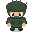
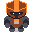
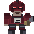
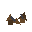

# Last Light Odyssey - Game Design Document
**Version 3.5 | Engine: Godot 4.6 | Last Updated: February 2026**

> *"The last journey of the human race isn't a hero's quest; it's a survival marathon."*

---

## Table of Contents
1. [Project Overview](#1-project-overview)
2. [The Management Layer](#2-the-management-layer-the-trail)
3. [The Tactical Layer](#3-the-tactical-layer-the-search)
4. [The Pressure Mechanic](#4-the-oregon-trail-pressure-mechanic)
5. [Win/Loss Conditions](#5-winloss-logic)
6. [Visual Direction](#6-visual-direction)
7. [Implementation Status](#7-implementation-status)
8. [Next Steps & Roadmap](#8-next-steps--roadmap)

---

## 1. Project Overview

### Concept
A space-faring survival manager inspired by **The Oregon Trail**, featuring **Fallout 1/2 style** isometric tactical exploration. Players guide the last remnants of humanity across the stars, making desperate choices about when to scavenge, when to trade, and when to flee.

### Core Loop
```
Strategic Navigation → Random Event Resolution → Resource Scarcity → Tactical Scavenging → Repeat
```

### Platform Target
- **Primary**: PC (Mouse & Keyboard)
- **Resolution**: 1920x1080 (scaled to 1600x900 window)
- **Renderer**: GL Compatibility (for broad hardware support)

---

## 2. The Management Layer (The "Trail")

This layer simulates the grueling trek across the stars.

### 2.1 Primary Statistics

| Statistic | Starting Value | Description |
|-----------|----------------|-------------|
| **Colonists** | 1,000 | The player's "health" and final score. Humanity's last survivors. |
| **Fuel** | 10 | The clock. Each jump consumes fuel. At 0, ship enters "Drift Mode" (−50 colonists per fuel deficit). |
| **Ship Integrity** | 100% | Damaged by space hazards. At 0%, the ship is destroyed. Game Over. |
| **Scrap** | 25 | Currency found on tactical maps. Used for repairs and trading. |

### 2.2 The Star Map (Node System)

A procedurally generated node graph with **50 nodes** leading to New Earth.

**Structure:**
- 16 rows of nodes with layout: [1, 2, 3, 5, 5, 5, 5, 5, 5, 5, 3, 4, 3, 3, 2, 1] = 50 total nodes
- Progression is bottom-to-top (start at bottom, New Earth at top)
- Each node connects to 1-3 nodes in adjacent rows (forward connections primary, backward connections at 30% chance)
- Variable fuel costs: base 2 fuel, +2 for column distance (horizontal/diagonal movement), +4 for backward travel
- Fuel costs are calculated per connection and saved with the star map
- **Fuel Warning**: Attempting a jump with insufficient fuel triggers a confirmation prompt detailing the penalties (colonist loss and integrity damage).
- If insufficient fuel for a jump, ship enters "Drift Mode" and loses 50 colonists per fuel deficit
- **Navigation Legend**: A legend is available in the navigation menu to explain node types and connection costs.
- **Goal Guarantee**: The "New Earth" node is programmatically guaranteed to be the final node (node 49) and cannot be bypassed.

**Node Types:**

| Type | Frequency | Description |
|------|-----------|-------------|
| **Empty Space** | 40% | No tactical map, just a random event roll. |
| **Scavenge Site** | 40% | Triggers Isometric Tactical Mode for resource gathering. Biome type pre-assigned. |
| **Trading Outpost** | 20% | Menu-based screen to trade Scrap for Fuel (10→5) or repairs (15→10%). |

### 2.3 Random Event System

Upon entering a node, the game rolls **1d10** against the Random Event Table.

**Current Events:**

| Roll | Event | Base Loss | Specialist | Mitigated Loss | Mitigation Cost |
|------|-------|-----------|------------|----------------|-----------------|
| 1 | Solar Flare | −70 colonists, −15% integrity | Tech | 0 colonists, −5% integrity | 18 scrap |
| 2 | Meteor Shower | −50 colonists, −25% integrity | Scout | 0 colonists, −10% integrity | 22 scrap |
| 3 | Disease Outbreak | −100 colonists | Medic | 0 colonists | 30 scrap |
| 4 | System Malfunction | −40 colonists, −20% integrity | Tech | 0 colonists, −10% integrity | 15 scrap |
| 5 | Pirate Ambush | −60 colonists, −30% integrity | Heavy | 0 colonists, −15% integrity | 28 scrap |
| 6 | Space Debris Field | −30 colonists, −20% integrity | Scout | 0 colonists, −10% integrity | 20 scrap |
| 7 | Sensor Ghost | No effect | — | — | — |
| 8 | Radiation Storm | −80 colonists, −10% integrity | Tech | 0 colonists, −5% integrity | 25 scrap |
| 9 | Cryo Pod Failure | −100 colonists | Medic | 0 colonists | 35 scrap |
| 10 | Clear Skies | No effect | — | — | — |

**Mitigation Cost Scaling:** Base scrap cost scales with progress: `base_cost × (1.0 + progress_ratio × 1.5)`, with 40% reduction for nodes 35+.

**Resolution:** Events display narrative text. If the required specialist is alive and the player has enough scrap, a "Mitigate" option becomes available.

---

## 3. The Tactical Layer (The "Search")

When the ship docks at a Scavenge Site, the game switches to isometric turn-based combat.

### 3.1 The Away Team

- Players select **3 Officers** from a roster of 6 (Captain, Scout, Tech, Medic, Heavy, Sniper)
- **Permadeath**: Dead officers are removed permanently
- Losing a specialist disables their event mitigation options

### 3.2 Officer Archetypes

| Role | Passive Ability | Active Ability | HP | Move | Sight |
|------|-----------------|----------------|-----|------|-------|
| **Captain** | — | **Execute** (1 AP): Guaranteed kill on enemy within 4 tiles below 50% HP. Never misses. 2-turn cooldown. | 100 | 5 | 6 |
| **Scout** | +2 sight range (base 8 + 2 = 10), extended enemy detection | **Overwatch** (1 AP): Reaction shot at first enemy that moves in LOS. Guaranteed hit. 2-turn cooldown. | 80 | 6 | 10 |
| **Tech** | Can see items through walls | **Turret** (1 AP): Deploy auto-firing sentry on adjacent tile. Lasts 3 turns, auto-shoots nearest enemy each turn (15 DMG, 6 tile range). 2-turn cooldown. | 70 | 4 | 5 |
| **Medic** | Can see exact enemy HP, +25% healing bonus | **Patch** (1 AP): Heal yourself or ally within 3 tiles for 62.5% max HP (50% base + 25% enhanced healing). 2-turn cooldown. | 75 | 5 | 5 |
| **Heavy** | Armor Plating (−20% damage taken), +35 base damage | **Charge** (1 AP): Rush enemy within 4 tiles. Instant-kills basic enemies; deals 2x base damage to heavy enemies. 2-turn cooldown. | 120 | 3 | 5 |
| **Sniper** | +2 sight range (base 7 + 2 = 9), +2 shoot range, +30 base damage | **Precision Shot** (1 AP): Guaranteed hit on any visible enemy. Deals 2x base damage (60). 2-turn cooldown. | 70 | 4 | 9 |

### 3.3 Combat System

**Turn Structure:**
- Unit-by-unit turn order (not side-based)
- Each officer acts in sequence, then all enemies act
- After all units act, a new round begins

**Action Point System:**
- Each unit has **2 AP** per round
- **Move**: 1 AP (distance up to move_range tiles)
- **Shoot**: 1 AP
- **Use Ability**: 1-2 AP (varies by ability)
- **Interact/Pickup**: Free (auto-pickup when stepping on items)

**Combat Calculations:**

```
Base Hit Chance = Class-based (varies by distance)
Adjacent (1 tile): 95%
Close (2 tiles): 90%
Medium (3-6 tiles): 50-85% (class-dependent)
Long (7+ tiles): 25-65% (class-dependent)

Defender Cover Modifier (reduces attacker's hit chance):
  - Half Cover (crates): −25% hit chance
  - Full Cover (walls): −50% hit chance

Attacker Cover Bonus (stable firing position):
  - Half Cover: +5% hit chance
  - Full Cover: +10% hit chance

Flanking Bonus:
  - Attacking from unprotected angle: +50% DAMAGE
  - Cover only protects from the direction it faces

Final Hit Chance = clamp(Base - DefenderCover + AttackerBonus, 20%, 95%)

**LOS Forgiveness:**
The Line of Sight algorithm includes "forgiveness" logic, allowing units to see slightly around corners and through adjacent cover to reduce frustration in tight tactical environments.
```

**Class Accuracy Profiles:**
- **Sniper**: Best long-range accuracy (65% at 10+ tiles, 70% at 8-10 tiles), slightly weaker at close range (85% at 2-4 tiles)
- **Scout**: Excellent at long range (65% at 8+ tiles)
- **Captain**: Balanced (50% at 8+ tiles)
- **Heavy**: Good close-mid range, weaker at distance (45% at 8+ tiles), 35 base damage
- **Tech/Medic**: Support-focused, weaker at range (40% at 8+ tiles)

### 3.4 Cover & Destruction

| Cover Type | Defender Penalty | Attacker Bonus | Destructible |
|------------|------------------|----------------|--------------|
| Half Cover | −25% to hit | +10% accuracy | Yes |
| Full Cover | −50% to hit | +15% accuracy | Yes |
| Walls | Blocks LOS | — | Some destructible |

When cover is destroyed, it becomes rubble (0% cover value).

**Flanking System:**
Cover only protects from the direction it faces. Attacking from an unprotected angle (flanking) bypasses cover AND deals **+50% bonus damage**. Tactical positioning is crucial!

### 3.5 Specialist Abilities Detail

#### Turret System (Tech Ability)
Tech officers can deploy **auto-firing sentry turrets** on tactical maps:

- **Placement**: Adjacent tile only, must be walkable and unoccupied
- **Duration**: 3 turns (auto-expires after 3 enemy turns)
- **Auto-Fire**: Each turn, turret automatically targets and shoots the nearest visible enemy within range
- **Range**: 6 tiles (Manhattan distance)
- **Damage**: 15 per shot (always hits)
- **Cooldown**: 2-turn cooldown after deployment
- **Visual Feedback**: Turret displays remaining turns with color-coded indicator

#### Charge System (Heavy Ability)
Heavy officers can **rush enemies** in close combat:

- **Range**: 4 tiles (Manhattan distance)
- **Movement**: Heavy automatically moves adjacent to target (if path exists)
- **Basic Enemies**: Instant kill on contact
- **Heavy Enemies**: Deals 2x base damage (70 damage from Heavy's 35 base damage)
- **Cooldown**: 2-turn cooldown after use
- **Visual**: Cinematic melee attack animation with camera focus

#### Execute System (Captain Ability)
Captains can **finish off weakened enemies** with precision:

- **Range**: 4 tiles (Manhattan distance)
- **Requirement**: Target must be below 50% HP
- **Effect**: Guaranteed instant kill (deals damage equal to target's current HP)
- **Accuracy**: Never misses (bypasses all cover and hit chance calculations)
- **Cooldown**: 2-turn cooldown after use
- **Visual**: Cinematic execution sequence with camera focus

#### Precision Shot System (Sniper Ability)
Snipers can **deliver devastating long-range shots** with perfect accuracy:

- **Range**: Any visible enemy (no distance restriction)
- **Requirement**: Target must be visible (within revealed fog of war)
- **Effect**: Guaranteed hit dealing 2x base damage (60 damage from 30 base damage)
- **Accuracy**: Never misses (bypasses all cover and hit chance calculations)
- **Cooldown**: 2-turn cooldown after use
- **Visual**: Cinematic precision aiming sequence with camera focus, "TAKING AIM..." message

### 3.6 Fog of War

- Map starts blacked out
- Reveals in radius around each officer (sight_range)
- Enemies are only visible when in revealed areas AND within sight range

### 3.7 Enemy AI

**Smart AI Behavior Priority:**
1. If flanked (in ineffective cover) → **Reposition to effective cover**
2. If exposed (no cover) → **Move to cover position**
3. If target in range + LOS + has AP → **Shoot**
4. If target visible + has AP → **Move to tactical position** (Visible enemies prioritize using all available AP for movement or attacks).
5. Otherwise → **Idle**

**Tactical Position Scoring:**
- Ideal engagement range: 4-7 tiles
- High bonus for cover that protects from current threats
- Bonus for maintaining LOS to targets
- Penalty for being too close or losing LOS
- Repositions when flanked to find effective cover

**Heavy Charge Ability:**
- Heavy can rush enemies within 4 tiles
- Instant-kills basic enemies on contact
- Deals double base damage (70) to heavy enemies
- Heavy has 35 base damage (increased from standard 25)

**Enemy Types:**

| Type | HP | Damage | AP | Move | Sight | Shoot Range | Overwatch Range | Base Spawn |
|------|-----|--------|-----|------|-------|-------------|-----------------|------------|
| Basic | 50 | 20 | 2 | 4 | 6 | 8 | 0 | 70-80% |
| Heavy | 80 | 35 | 3 | 3 | 5 | 6 | 0 | 20-30% |
| Sniper | 40 | 30 | 2 | 5 | 10 | 12 | 5 | Rare (difficulty-based) |
| Elite | 100 | 40 | 3 | 4 | 7 | 9 | 0 | Rare (difficulty-based) |
| Boss | 250* | 70* | 4 | 3 | 8 | 9 | 0 | Biome-specific |

*\*Boss HP and damage scale with `difficulty_multiplier`. Each biome has a unique boss variant (Station, Asteroid, Planet).*

*Note: Spawn rates vary by biome (see Section 3.8 Biome System). Sniper and Elite enemies appear more frequently as mission difficulty increases.*

### 3.8 Biome System

Scavenge sites have one of three procedurally-assigned biome types, each with unique map generation, visuals, and enemy distribution.

| Biome | Map Type | Size | Enemies | Heavy % | Loot Focus |
|-------|----------|------|---------|---------|------------|
| **Derelict Station** | BSP Rooms & Corridors | 17-20 | 4-6 | 30% | Balanced |
| **Asteroid Mine** | Cellular Automata Caves | 14-17 | 3-5 | 50% | More Scrap |
| **Planetary Surface** | Open Field w/ Clusters | 24-27 | 5-8 | 20% | More Fuel |

**Generation Algorithms:**
- **Station**: Binary Space Partitioning creates interconnected rooms with corridors. Industrial aesthetic with metal floors and walls.
- **Asteroid**: Cellular automata generates organic cave networks. Rocky browns with tighter spaces and high-value scrap deposits.
- **Planet**: Open terrain with scattered obstacle clusters and cover. Alien teal/purple aesthetic with bioluminescent elements.

**Biome Assignment:**
- Biomes are pre-assigned to scavenge nodes during star map generation
- Variety balancing ensures all three biome types appear across the journey
- Each biome has distinct visual themes and color palettes

### 3.9 Mission Difficulty Scaling

The game implements a dynamic difficulty system that scales mission challenges based on player progress through the star map.

**Difficulty Formula:**
- Base difficulty: 1.0x at node 0 (start)
- Scaling factor: 1.5x multiplier applied based on progress ratio
- Final difficulty: ~2.5x at node 49 (near end)
- **Final Stage Reduction**: Nodes 35+ (final 15 nodes) have reduced scaling (40% reduction) to prevent excessive difficulty spikes

**Difficulty Effects:**
- **Enemy Count**: Scaled by difficulty multiplier (capped at 2x base, hard cap at 15 enemies)
- **Heavy Enemy Spawn Chance**: Increases with difficulty (base chance + (difficulty - 1.0) × 0.3)
- **Sniper/Elite Enemies**: More likely to spawn in higher difficulty missions

**Balancing Philosophy:**
- Early missions (nodes 0-20): Learning phase, moderate challenge
- Mid missions (nodes 21-34): Increasing difficulty, tactical depth required
- Final missions (nodes 35-49): Reduced scaling prevents frustration while maintaining challenge

### 3.10 Mission Objectives System

Scavenge missions now feature **biome-specific objectives** that provide bonus rewards upon completion. Each mission randomly selects one objective from the biome's available options.

**Objective Types:**
- **Binary Objectives**: Complete once (e.g., hack security, repair core, activate mining)
- **Progress Objectives**: Complete multiple times (e.g., retrieve 3 data logs, collect 5 samples, clear 4 passages)

**Biome-Specific Objectives:**

| Biome | Objective ID | Description | Type | Max Progress | Bonus Reward |
|-------|--------------|-------------|------|--------------|--------------|
| **Station** | hack_security | Hack security systems | Binary | 1 | +12 Fuel |
| | retrieve_logs | Retrieve data logs | Progress | 3 | +25 Scrap |
| | repair_core | Repair power core | Binary | 1 | +25% Hull Repair |
| **Asteroid** | clear_passages | Clear cave passages | Progress | 4 | +20 Scrap |
| | activate_mining | Activate mining equipment | Binary | 1 | +22 Scrap |
| | extract_minerals | Extract rare minerals | Progress | 2 | +30 Scrap |
| **Planet** | collect_samples | Collect alien samples | Progress | 5 | +20 Colonists |
| | activate_beacons | Activate beacons | Progress | 3 | +18 Colonists |
| | clear_nests | Clear hostile nests | Binary | 1 | +25 Colonists |

**Objective Interactables:**
Each objective requires interacting with specific objects on the tactical map:
- **Station**: Security Terminal, Data Log, Power Core
- **Asteroid**: Mining Equipment (for clearing passages and activating), Mining Equipment (for extracting minerals)
- **Planet**: Sample Collector, Beacon, Nest

**Objective Completion:**
- Objectives are tracked in the Objectives Panel (top-right of tactical HUD)
- Progress objectives show current/max progress (e.g., "Collect alien samples (3/5)")
- Binary objectives show completion status (e.g., "Hack security systems - COMPLETE")
- Bonus rewards are awarded immediately upon objective completion
- Objectives are displayed in the team selection dialog before mission start

**Reward System:**
- Bonus rewards are deterministic - what is displayed is what the player receives
- Rewards are shown in the team selection dialog before accepting the mission
- Completing objectives provides significant resource bonuses beyond standard loot collection

---

## 4. The "Oregon Trail" Pressure Mechanic

To prevent players from spending unlimited turns looting, the **Cryo-Stability Timer** creates urgency.

### Stability System

| Phase | Effect |
|-------|--------|
| **100%** | Mission start |
| **100% → 0%** | Decreases by **5%** every round (reduced to **3%** in final stages - nodes 35+) |
| **0% (Collapse)** | "CRYO-FAILURE" warning displays |
| **Each round at 0%** | −10 colonists immediately |

**Final Stage Balancing:** In nodes 35+ (final 15 nodes), stability loss per turn is reduced by 2% (from 5% to 3%) to give players more tactical turns in the critical final stretch.

### Extraction

- Extraction zone marked on map
- Extraction zone marked on map
- Mission ends when **all surviving officers** reach extraction tiles (Captain is no longer required to be in the zone personally for extraction to succeed).
- Resources collected during mission are added to ship totals upon extraction

### Mission Abort

Players can pause during tactical missions and choose to **Abandon Mission**:
- Costs **20 colonists** as penalty
- All deployed officers return safely (even if surrounded)
- No resources are gained from the mission (all collected fuel and scrap are forfeited)
- Pause menu displays current mission haul and warns about resource forfeiture
- Ship status display shows current colonists, fuel, integrity, scrap, and stability with color-coded indicators
- Useful when a mission goes badly wrong

---

## 5. Win/Loss Logic

### Win Condition
Reach the **"New Earth"** node (node 49, the final node) with **Colonists > 0**.

### Ending Tiers

| Colonists | Ending | Title |
|-----------|--------|-------|
| 1,000 | Perfect | "The Golden Age" |
| 500–999 | Good | "The Hard Foundation" |
| 1–499 | Bad | "The Endangered Species" |

### Voyage Recap Screen
Upon reaching New Earth, players are shown a comprehensive **Voyage Recap** screen displaying:
- **Final State**: Colonists remaining, fuel reserves, ship integrity, scrap stockpile
- **Officer Status**: Survival status for all 6 officers (alive or K.I.A.)
- **Cumulative Statistics** (tracked across entire voyage):
  - Total fuel collected from missions
  - Total scrap collected from missions
  - Total hostiles eliminated
  - Missions completed
  - Tactical turns survived
  - Sectors traversed (nodes visited)

### Game Over Recap Screen
Upon game over, players are shown a comprehensive **Game Over Recap** screen displaying:
- **Failure Reason**: Specific game over message (extinction, ship destroyed, captain lost)
- **Final State**: Colonists remaining, fuel reserves, ship integrity, scrap stockpile
- **Officer Status**: Survival status for all 6 officers (alive, K.I.A., or contextual messages based on failure type)
- **Cumulative Statistics** (tracked across entire voyage):
  - Total fuel collected from missions
  - Total scrap collected from missions
  - Total hostiles eliminated
  - Missions completed
  - Tactical turns survived
  - Sectors traversed (nodes visited)

### Loss Conditions

| Condition | Message |
|-----------|---------|
| Colonists = 0 | "EXTINCTION: Humanity's light has been extinguished." |
| Ship Integrity = 0% | "CATASTROPHIC FAILURE: The ship has been destroyed." |
| Captain dies | "LEADERSHIP LOST: Without leadership, the mission cannot continue." |

### Voyage Intro Scene
When starting a new game, players are shown an **Oregon Trail-style intro scene** that sets the narrative tone:
- **Procedural Scene Generation**: Pixel-art style scene with starship and space backdrop
- **Random Description**: One of four randomly selected voyage descriptions
- **Typewriter Effect**: Description text animates character-by-character
- **Visual Style**: Epic, hopeful but somber color palette with scanline overlay
- **Timing**: Shown before tutorial begins, blocks interaction until dismissed

### Colonist Loss Milestone System
As colonists are lost throughout the voyage, the game displays **emotional milestone scenes** when crossing critical thresholds:

**Milestone Thresholds:**
- **750 colonists** (250 lost): "CASUALTIES MOUNT" - The weight of command grows heavier
- **500 colonists** (500 lost): "THE WEIGHT OF COMMAND" - Half the mission is gone
- **250 colonists** (750 lost): "DESPERATION" - Only a quarter remain
- **100 colonists** (900 lost): "ALL HOPE LOST" - One hundred souls remain
- **0 colonists** (1000 lost): "EXTINCTION" - The last cryosleeper has failed

**Scene Features:**
- **Procedural Scene Generation**: Each threshold has unique visual elements and color palette (getting darker/more desperate)
- **Narrative Text**: Emotional descriptions of the psychological impact on the ship's commander
- **Typewriter Effect**: Description animates character-by-character
- **Timing**: Shown after node events or mission completion when thresholds are crossed
- **One-Time Display**: Each milestone is shown only once per playthrough

---

## 6. Visual Direction

### Art Style
- **Low-fidelity 2D sprites** with gritty color palette
- Dark grays, industrial oranges, neon blues
- Isometric tactical view (32×32 tile grid)
- **Procedural map rendering** with biome-specific color themes (no sprite tiles for terrain)
- Programmatic drawing for floors, walls, cover, and extraction zones

### Visual Rendering System

**Tactical Map Rendering:**
- Maps are procedurally generated and rendered using Godot's `_draw()` system
- Each tile (32×32 pixels) is drawn programmatically with biome-specific colors
- Visual variation achieved through position-based hash functions for deterministic "randomness"
- Fog of war system with biome-specific dark fog colors
- Real-time tile highlighting for movement range (blue), execute range (red), and hover (yellow)

**Biome Visual Themes:**
- **Station**: Dark industrial metal floors (blue-gray), lighter metal walls with cyan/teal accent lighting, orange-brown cargo crates, green extraction zones with landing pad grid patterns
- **Asteroid**: Rocky brown floors and walls, blue mineral accents, organic rock formations for cover, blue-tinted extraction zones
- **Planet**: Alien green grass floors, purple/magenta crystal wall formations with bioluminescent glows, teal mushroom and crystal cover objects, teal extraction zones with alien energy patterns

**Visual Details:**
- Floor tiles include subtle panel lines, blood splatters (Station), rock crevices (Asteroid), and grass blade marks (Planet)
- Wall tiles feature autotiling with connection-based rendering, highlights/shadows for depth, and biome-specific decorations (rivets, pipes, terminals for Station; crystal formations for Planet)
- Cover objects are drawn as 3D-style isometric crates/barriers with shadows and highlights
- Extraction zones have distinct biome-specific designs with corner markers and pulsing center lights

**Background Patterns:**
- Full-screen repeating background patterns (128×128 tile patterns) drawn behind tactical maps
- **Station**: Industrial grid with cyan accent lines and panel corner highlights
- **Asteroid**: Rocky texture with irregular crack lines and blue mineral veins with glow effects
- **Planet**: Organic growth patterns with curved lines, bioluminescent spots, and alien plant tendrils
- Patterns provide atmospheric context without interfering with gameplay visibility

### Visual Effects & Animations

**Unit Animations:**
- **Idle Animation**: Subtle vertical sway for all units (officers and enemies)
- **Damage Flash**: White flash → red tint → knockback recoil → return to normal
- **Death Animation**: Fade out with rotation and scale effects
- **Attack Animation**: Brief recoil and flash for shooting units
- **Movement**: Smooth pathfinding-based movement with tween interpolation

**Combat Visual Effects:**
- **Projectile Trails**: Line2D projectiles with color-coded paths (blue for officers, red for enemies)
- **Damage Popups**: Floating damage numbers with color coding (green for healing, red for damage)
- **Screen Shake**: Subtle camera shake on heavy melee attacks (Charge ability)
- **Combat Camera**: Cinematic zoom-in during attacks, focuses on action, returns to tactical view
- **Ability Visuals**:
  - **Charge**: Windup → lunge → impact flash → return
  - **Execute**: Cinematic camera focus with execution sequence
  - **Precision Shot**: "TAKING AIM..." message with camera focus
  - **Turret**: Cyan rotation pulse and scale animation on fire
  - **Overwatch**: Reaction shot with camera focus

**Mission Transitions:**
- **Beam Down**: Officers descend from above with light beam effects, materialize with white flash
- **Beam Up**: Officers float upward with extraction beam, fade out with white flash
- **Mission Unit Pulse**: Mission-critical units (e.g., interactable objectives) feature a pulsing yellow highlight to draw player attention.
- **Transition Fades**: 
  - Smooth fade transitions between management and tactical layers.
  - Slow, atmospheric fade-in sequence on the title screen (Black screen → Music → Title → UI).
  - Fade effects correctly handle layering to ensure text/UI visibility during transitions.

**Visual Feedback Systems:**
- **Selection Ring**: Green pulsing ring around active officer
- **HP Bars**: Color-coded (green >50%, yellow 25-50%, red <25%) with smooth scaling
- **AP Indicators**: Gold dots for available AP, dark gray for used
- **Cover Indicators**: Visual half/full cover indicators on units
- **Cover Bonus Display**: Shows attacker cover bonus (+5% for half cover, +10% for full cover) when unit is in cover
- **Status Label**: Dynamic status display showing unit state (WAITING, NO ACTIONS, CRITICAL, READY) with color coding
- **Hit Chance Display**: Percentage shown on targetable enemies
- **Target Highlighting**: Red outline on enemies that can be attacked
- **Movement Range**: Blue overlay on reachable tiles
- **Execute Range**: Red overlay for Captain's Execute ability range
- **Pathfinding Visualization**: Neon blue glowing path line with arrowhead showing unit's movement path when hovering over destination tiles
- **Unit Stats Tooltip**: Hover tooltip displaying unit statistics (HP, AP, movement range, sight range, shoot range, damage, unit type) with color-coded HP and AP indicators
- **Comprehensive Tooltips**: Extensive tooltip system for all UI elements (pause button, turn label, stability, haul, HP, AP, end turn, extract, abilities, movement, attack range, status, cover bonus)

**Camera System:**
- **Tactical View**: Default zoom (1.0x) with smooth camera centering on unit selection
- **Combat Zoom**: Automatic zoom to maximum (3.0x) during attack sequences
- **Manual Controls**: 
  - Scroll wheel zoom (0.4x to 3.0x range)
  - Middle mouse button pan/drag
  - Smooth interpolation for all camera movements
- **Camera Memory**: The camera maintains its current zoom level when transitioning between player and enemy turns.
- **Camera Focus**: Automatically centers on units at turn start, focuses on combat actions, and includes a brief pause between consecutive turns of the same unit for better visual clarity.

**Interactable Object Effects:**
- **Hover Effect**: Brightness pulse when mouse hovers over items
- **Idle Animation**: Subtle floating/bobbing motion
- **Collection Effect**: Fade out with scale animation when picked up

**Star Map Visuals (Management Layer):**
- **Node Sprites**: Planet variations (Earth, Red, Gas) for Empty Space nodes, Asteroid sprite for Scavenge Sites, Trading Station sprite for Trading Outposts
- **Node States**: Color-coded labels and glows (Amber for available, Green for current, Gray for visited, Dark gray for locked)
- **Pulse Animation**: Available nodes pulse with amber glow effect (looping fade in/out)
- **Connection Lines**: Amber lines connecting nodes (transparent for locked, brighter for available paths)
- **Ship Animation**: Animated ship sprite travels along connection lines when jumping between nodes (1.5 second smooth tween)
- **Camera System**: Pan with right/middle mouse drag, zoom with scroll wheel (0.5x to 2.0x), smooth camera centering on current node
- **Visual Feedback**: Hover effects on clickable nodes, fuel cost display on hover

**Title Screen & UI Transitions:**
- **Animated Starfield**: 200 parallax stars with depth-based movement speed
- **Typewriter Effect**: Subtitle text animates character-by-character
- **Title Glow**: Pulsing glow effect on main title
- **Button Animations**: Scale-up on hover, smooth transitions, and hover sound effects (SFX) for all interactive buttons.
- **Fade Transitions**: Smooth fade between scenes (management ↔ tactical) with consistent timing.

### UI Philosophy
- **Diegetic/Retro**: 1980s monochrome CRT terminal aesthetic
- Amber text on dark backgrounds
- Minimal, functional displays
- Resource icons for quick visual recognition
- **Input Refinement**: Dialogue dismissal is protected against accidental mouse scroll wheel inputs.
- **Legend Overlay**: Real-time legend available in navigation to explain node types.
- Color-coded status indicators (HP bars, AP dots, stability warnings)

### Tutorial System
First-time players receive a **9-step guided tutorial** that covers:

1. **Star Map Navigation** - How to plot course and fuel costs
2. **Resource Management** - Understanding colonists, fuel, hull, and scrap
3. **Random Events** - How events work and specialist mitigation
4. **Scavenge Missions** - Team selection and permadeath warning
5. **Tactical Movement** - Action points and movement
6. **Combat** - Attacking enemies and cover mechanics
7. **Abilities** - Specialist unique abilities (Scout Overwatch, Tech Turret, Medic Patch, Heavy Charge, Captain Execute, Sniper Precision Shot)
8. **Cryo-Stability** - Time pressure and colonist loss
9. **Extraction** - Completing missions

Tutorial can be skipped at any time and reset from the Settings menu.

---

### Sprite Assets (52 PNG files)

**Status: COMPLETE** - All unit sprites, interactable objects, UI icons, and navigation assets are implemented and in use.

**Note:** Tactical maps are procedurally generated and rendered using biome-specific color themes. All terrain, floors, walls, cover, and extraction zones are drawn programmatically via `_draw()` rather than using sprite files.

#### Officer Characters (6 sprites)
The player's controllable units, each with distinct visual identity matching their role.

| Captain | Scout | Tech | Medic | Heavy | Sniper |
|:-------:|:-----:|:----:|:-----:|:-----:|:------:|
|  |  |  |  |  |  |
| Command leader | Recon specialist | Engineer | Field medic | Tank/Defender | Long-range marksman |

#### Enemy Units — Station Biome (5 sprites)
Default enemy sprites used in Station biome missions.

| Basic | Heavy | Sniper | Elite | Boss |
|:-----:|:-----:|:------:|:-----:|:----:|
|  |  |  |  |  |
| 70-80% spawn | 20-30% spawn | Difficulty-based | Difficulty-based | Biome boss |

#### Enemy Units — Asteroid Biome (5 sprites)

| Basic | Heavy | Sniper | Elite | Boss |
|:-----:|:-----:|:------:|:-----:|:----:|
|  |  |  |  |  |

#### Enemy Units — Planet Biome (5 sprites)

| Basic | Heavy | Sniper | Elite | Boss |
|:-----:|:-----:|:------:|:-----:|:----:|
|  |  |  |  |  |

#### Unit Indicators (3 sprites)
Visual feedback elements for unit states.

| Selection Ring | Shadow | Turret |
|:--------------:|:------:|:------:|
|  |  |  |
| Active unit indicator | Ground shadow for depth | Tech officer deployable sentry |

---

#### Interactable Objects (11 sprites)
Items and cover objects found on tactical maps.

**Standard Loot:**
| Fuel Crate | Scrap Pile | Health Pack | Cover Crate | Destroyed Cover |
|:----------:|:----------:|:-----------:|:-----------:|:---------------:|
|  |  |  |  |  |
| +1 Fuel | +5 Scrap | +62.5% Max HP | Half cover (−25%) | Rubble (0% cover) |

*Note: Health Packs spawn 1-2 per tactical map and restore 62.5% of maximum HP when picked up (same healing value as Medic's Patch ability).*

**Objective Interactables (7 sprites):**

| Security Terminal | Data Log | Power Core | Mining Equipment | Sample Collector | Beacon | Nest |
|:-----------------:|:--------:|:----------:|:----------------:|:----------------:|:------:|:----:|
|  |  |  |  |  |  |  |
| Station: hack security | Station: retrieve logs | Station: repair core | Asteroid: all objectives | Planet: collect samples | Planet: activate beacons | Planet: clear nests |

---

#### Procedural Environment Art (No Sprite Files)

All tactical map visuals — floors, walls, cover objects, extraction zones, fog of war, and tile highlights — are rendered programmatically via Godot's `_draw()` system using biome-specific color themes defined in `BiomeConfig`. No sprite files are used for environment rendering.

**Station Biome — Dark Industrial Metal**

| Element | Visual | Colors |
|---------|--------|--------|
| **Floors** | Dark blue-gray metal panels with subtle panel lines and blood splatters | Base `(0.10, 0.11, 0.14)`, variation `(0.12, 0.13, 0.17)` |
| **Walls** | Lighter industrial metal with autotiled connections, rivets, pipes, and terminal decorations | Base `(0.28, 0.32, 0.40)`, highlight `(0.45, 0.50, 0.58)` |
| **Cover** | Orange-brown cargo crates and green supply crates with 3D isometric shading | Main `(0.65, 0.45, 0.25)`, green `(0.35, 0.55, 0.30)` |
| **Extraction** | Green safety zone with landing pad grid pattern and corner markers | Zone `(0.06, 0.18, 0.10)`, markers `(0.3, 0.95, 0.5)` |
| **Accents** | Bright cyan/teal glow lights on walls and panels | Glow `(0.3, 0.9, 1.0)` |
| **Fog** | Dark blue-black unexplored area | `(0.01, 0.02, 0.04)` |

**Asteroid Biome — Rocky Caves**

| Element | Visual | Colors |
|---------|--------|--------|
| **Floors** | Dark rocky brown with rock crevices and mineral deposits | Base `(0.15, 0.12, 0.10)`, variation `(0.20, 0.16, 0.12)` |
| **Walls** | Organic brown rock formations (cellular automata generated) | Base `(0.28, 0.22, 0.18)`, highlight `(0.38, 0.32, 0.26)` |
| **Cover** | Natural rock formations with brown shading | Main `(0.35, 0.28, 0.22)`, highlight `(0.45, 0.38, 0.32)` |
| **Extraction** | Blue-tinted safe zone with blue markers | Zone `(0.10, 0.15, 0.25)`, markers `(0.4, 0.6, 0.9)` |
| **Fog** | Dark blue-tinted fog | `(0.02, 0.02, 0.04)` |

**Planet Biome — Alien World**

| Element | Visual | Colors |
|---------|--------|--------|
| **Floors** | Dark green alien grass with blade marks and vegetation | Base `(0.12, 0.18, 0.10)`, variation `(0.15, 0.22, 0.12)` |
| **Walls** | Purple/magenta crystal formations with bioluminescent glows | Base `(0.45, 0.28, 0.50)`, crystal `(0.70, 0.40, 0.75)`, glow `(0.80, 0.50, 0.90)` |
| **Cover** | Teal mushroom caps, purple crystals, and orange bioluminescent mushrooms | Teal `(0.35, 0.55, 0.58)`, crystal `(0.55, 0.35, 0.60)`, orange `(0.85, 0.55, 0.20)` |
| **Extraction** | Teal alien energy zone with cyan markers | Zone `(0.15, 0.30, 0.28)`, markers `(0.4, 0.95, 0.85)` |
| **Accents** | Bioluminescent orange/yellow/pink spores and tendrils | Orange `(0.95, 0.60, 0.15)`, yellow `(1.0, 0.85, 0.30)`, pink `(0.95, 0.45, 0.65)` |
| **Fog** | Dark purple-tinted fog | `(0.08, 0.05, 0.10)` |

**Shared Tile Overlays (Programmatic)**

| Overlay | Purpose | Color |
|---------|---------|-------|
| **Movement range** | Blue highlight on reachable tiles | `(0.2, 0.5, 0.9, 0.35)` |
| **Attack range** | Red highlight on targetable enemies | `(0.9, 0.2, 0.2, 0.35)` |
| **Hover** | Yellow highlight on moused-over tiles | `(0.9, 0.8, 0.2, 0.35)` |
| **Pathfinding line** | Neon blue glowing path with arrowhead | Blue glow with additive blending |

**Background Patterns (128x128 repeating)**
- **Station**: Industrial grid with cyan accent lines and panel corner highlights
- **Asteroid**: Rocky texture with irregular crack lines and blue mineral veins with glow effects
- **Planet**: Organic growth patterns with curved lines, bioluminescent spots, and alien plant tendrils

---

#### Star Map Navigation Icons (5 sprites)
Visual elements for the management layer star map.

| Asteroid Field | Trading Station | Earth (Goal) | Gas Planet | Red Planet |
|:--------------:|:---------------:|:------------:|:----------:|:----------:|
|  |  |  |  |  |
| Scavenge Site | Trading Outpost | New Earth (Win) | Empty Space variant | Empty Space variant |

---

#### UI Icons (12 sprites)
Interface icons used throughout the game for resource displays, combat info, and settings.

**Resource Icons**
| Colonists | Fuel | Hull | Scrap | Cryo Stability |
|:---------:|:----:|:----:|:-----:|:--------------:|
|  |  |  |  |  |

**Combat & HUD Icons**
| Health | Action Points | Movement | Turn | Enemies |
|:------:|:-------------:|:--------:|:----:|:-------:|
|  |  |  |  |  |

**System Icons**
| Display |
|:-------:|
|  |

---

## 7. Implementation Status

### ✅ Phase 1: Core Systems (COMPLETE)
- [x] Global game state management (`GameState` autoload)
- [x] Primary statistics tracking with signals
- [x] Win/loss condition checking
- [x] Officer roster with alive/deployed states
- [x] Jump logic with fuel consumption and drift mode

### ✅ Phase 2: Star Map & Events (COMPLETE)
- [x] Procedural star map generator (16 columns, 50 total nodes)
- [x] Node connection system with variable fuel costs
- [x] Visual node graph with clickable navigation
- [x] Node type system (Empty, Scavenge, Trading)
- [x] Biome type pre-assignment for scavenge sites
- [x] Random event system with 10 events
- [x] Specialist mitigation for events (including Heavy)
- [x] Event dialog UI

### ✅ Phase 3: Tactical Framework (COMPLETE)
- [x] Grid-based tilemap system (variable size per biome)
- [x] A* pathfinding for movement
- [x] Point-and-click movement with path visualization
- [x] Visual pathfinding path line with glow effects and arrowhead
- [x] Fog of war with per-unit reveal radius
- [x] Interactable objects (Fuel Crates, Scrap Piles, Health Packs)
- [x] Objective-specific interactable objects (Terminals, Logs, Cores, Equipment, Collectors, Beacons, Nests)
- [x] Auto-pickup system
- [x] Health Packs spawn on tactical maps (1-2 per map) and restore 62.5% max HP when picked up
- [x] Procedural map generation with three biome types
- [x] BSP room generation (Station biome)
- [x] Cellular automata cave generation (Asteroid biome)
- [x] Open field generation (Planet biome)

### ✅ Phase 4: Combat System (COMPLETE)
- [x] Turn-based unit-by-unit system
- [x] Action Point management
- [x] Line-of-sight calculations (Bresenham's algorithm)
- [x] Cover system with hit chance modifiers
- [x] Flanking system with directional cover
- [x] Class-based accuracy profiles
- [x] Shooting with hit/miss resolution
- [x] Damage calculation and HP bars
- [x] Smart Enemy AI with flanking awareness and repositioning
- [x] Enemy visibility tied to fog of war
- [x] Attackable target highlighting with hit chance display
- [x] Cover indicators on units showing protection level

### ✅ Phase 5: Specialist Abilities (COMPLETE)
- [x] Scout: Overwatch (reaction shots, guaranteed hit)
- [x] Tech: Turret (deploy auto-firing sentry, 3 turns)
- [x] Medic: Patch (heal allies)
- [x] Heavy: Charge (rush and devastate enemies)
- [x] Heavy: Armor Plating passive (20% damage reduction)
- [x] Heavy: Increased base damage (35 vs standard 25)
- [x] Captain: Execute (guaranteed kill on low-HP enemies)
- [x] Ability cooldown system (2-turn cooldown after use)
- [x] Ability buttons in HUD
- [x] AP cost validation

### ✅ Phase 6: Pressure Mechanic (COMPLETE)
- [x] Cryo-Stability bar and display
- [x] Stability drain per round (5%)
- [x] Colonist loss at 0% stability
- [x] Warning messages and visual feedback
- [x] Extraction zone system

### ✅ Phase 7: Visual Polish (COMPLETE)
- [x] Character sprites for all officer types
- [x] Enemy sprites (basic, heavy, sniper, elite)
- [x] Environment tileset
- [x] Selection indicators and HP bars
- [x] Damage popup numbers
- [x] Combat camera focus during attacks
- [x] Projectile visual effects
- [x] Idle animations for units
- [x] Cover indicators (half/full cover visual feedback)
- [x] Hit chance display on targetable enemies
- [x] Biome-specific visual themes and backgrounds

### ✅ Phase 8: UI & UX Polish (COMPLETE)
- [x] Tactical HUD with unit info
- [x] Objectives Panel in tactical HUD (displays mission objectives and progress)
- [x] Management HUD with ship stats
- [x] Team selection dialog with objective preview and potential rewards
- [x] Trading dialog with fuel purchase and hull repair
- [x] Event dialog with choices
- [x] Title menu with animated starfield, typewriter subtitle, and polish
- [x] Settings menu (display, tutorial reset)
- [x] Tutorial system with 9-step guided onboarding
- [x] Pause menu with abandon mission option, mission haul tracking, and ship status display
- [x] Confirmation dialog for destructive actions
- [x] Game over and victory screens with ending text
- [x] Restart game functionality
- [x] Comprehensive tooltip system for all UI elements
- [x] Cover bonus display in tactical HUD (+5% half cover, +10% full cover)
- [x] Dynamic status label system (WAITING, NO ACTIONS, CRITICAL, READY)
- [x] Color-coded ship status indicators in pause menu (stability, fuel, integrity)
- [x] Resource forfeiture warning in pause menu when abandoning missions

### ✅ Phase 9: Save/Load System (COMPLETE)
- [x] Save game state to JSON file (colonists, fuel, integrity, scrap, officers)
- [x] Save star map layout and node progress
- [x] Save node types and biome assignments
- [x] Save cumulative mission statistics (fuel collected, scrap collected, enemies killed, missions completed, tactical turns)
- [x] Save colonist loss milestone tracking
- [x] Load game state on continue
- [x] Continue button on title menu (disabled if no save)
- [x] New game confirmation dialog when save exists
- [x] Delete save functionality
- [x] Settings persistence (display, tutorial state)

### ✅ Phase 11: Mission Objectives System (COMPLETE)
- [x] Mission objective system with binary and progress objective types
- [x] Biome-specific objective definitions (Station, Asteroid, Planet)
- [x] Objective interactable objects (Terminals, Logs, Cores, Equipment, Collectors, Beacons, Nests)
- [x] Objectives Panel UI for tracking mission progress
- [x] Bonus reward system for objective completion
- [x] Objective preview in team selection dialog
- [x] Objective completion notifications

### ✅ Phase 12: Narrative & Feedback Systems (COMPLETE)
- [x] Voyage intro scene with procedural generation and typewriter effect
- [x] Colonist loss milestone system with emotional scenes at thresholds (750, 500, 250, 100, 0)
- [x] Procedural scene generation for milestone scenes with threshold-specific color palettes
- [x] Game Over Recap screen with cumulative statistics and officer status
- [x] Unit stats tooltip system (hover to display HP, AP, ranges, damage)
- [x] Milestone tracking persistence in save system

### ⏳ Phase 13: Game Feel & Balance (IN PROGRESS)
- [x] Mission difficulty scaling system (1.0x to ~2.5x based on progress)
- [x] Final stage balancing (reduced stability loss and difficulty scaling in nodes 35+)
- [x] Navigation penalties (ship integrity and stability loss per jump)
- [x] Drift mode penalty tuning (50 colonists per fuel deficit)
- [x] Fuel cost system refinement (base 2, +2 row distance, +4 backward)
- [x] Combat damage/accuracy fine-tuning
- [x] Music integration (Title, Navigation, Tactical)
- [x] Audio ducking system during dialogue/events

---

## 8. Next Steps & Roadmap

### ✅ Recently Completed

#### Title Menu & Game Flow
- [x] Animated starfield background with 200 parallax stars
- [x] Typewriter subtitle animation ("The final journey of humanity begins")
- [x] Title glow pulsing effect
- [x] Button hover scale animations
- [x] New Game / Continue / Settings / Quit buttons
- [x] Music: Title menu music with looping and volume control
- [x] Transition Fades: Slow fade-in sequence on startup
- [x] Continue button disabled when no save exists
- [x] Confirmation dialog for new game when save exists
- [x] Fade transitions between scenes
- [x] Game over screen with restart option
- [x] Victory screen with ending tier text

#### Save/Load System
- [x] Full game state persistence (colonists, fuel, integrity, scrap)
- [x] Officer status persistence (alive/deployed state)
- [x] Star map layout persistence (nodes, connections, types, fuel costs)
- [x] Node progress persistence (current node, visited nodes)
- [x] Continue game from title menu
- [x] Delete save when starting new game

#### Settings Menu
- [x] Display settings (fullscreen toggle, resolution: 720p/900p/1080p)
- [x] Reset Tutorial button with visual feedback
- [x] Settings persistence to user://settings.cfg
- [x] Apply button with confirmation feedback

#### Tutorial System
- [x] TutorialManager autoload singleton
- [x] 9-step guided onboarding sequence
- [x] Tutorial overlay with animated prompts
- [x] Directional arrow indicators
- [x] Skip tutorial option
- [x] Tutorial state persistence
- [x] Reset tutorial from settings

#### Trading System Enhancement
- [x] Buy fuel: 10 scrap → 5 fuel
- [x] Repair hull: 15 scrap → 10% integrity
- [x] Status feedback on transactions
- [x] Button availability based on resources

#### Additional UI
- [x] Reusable confirmation dialog component
- [x] Fuel Warning Prompt with "Don't show again" functionality
- [x] Navigation Legend for node type identification
- [x] Button Hover SFX across all UI elements

#### Heavy Officer Class
- [x] New officer type: Heavy
- [x] Armor Plating passive ability (20% damage reduction)
- [x] Charge active ability (1 AP, rush enemy within 4 tiles, instant-kills basic enemies)
- [x] Increased base damage (35 vs standard 25)
- [x] 120 HP, 3 move range, 5 sight range
- [x] Heavy sprite and animations
- [x] Pirate Ambush event mitigation

#### Sniper Officer Class
- [x] New officer type: Sniper
- [x] Extended sight range (+2) and shoot range (+2) for long-range combat
- [x] Increased base damage (30 vs standard 25)
- [x] Precision Shot active ability (1 AP, guaranteed hit on any visible enemy for 2x damage)
- [x] 70 HP, 4 move range, 9 sight range, 12 shoot range
- [x] Best long-range accuracy profile (65% at 10+ tiles)
- [x] Sniper sprite with hood and targeting monocle

#### Biome System
- [x] Three biome types: Station, Asteroid, Planet
- [x] BSP room generation for Station maps
- [x] Cellular automata cave generation for Asteroid maps
- [x] Open field generation with obstacle clusters for Planet maps
- [x] Biome-specific enemy counts and heavy spawn rates
- [x] Biome-specific loot distributions
- [x] Biome pre-assignment to scavenge nodes with variety balancing
- [x] Distinct visual themes and color palettes per biome

#### Smart Enemy AI
- [x] Flanking awareness - AI recognizes when cover is ineffective
- [x] Automatic repositioning when being flanked
- [x] Prioritizes finding cover that protects from threats
- [x] Evaluates cover effectiveness based on threat directions

#### Mission Difficulty Scaling
- [x] Dynamic difficulty multiplier based on node progress (1.0x at start, ~2.5x at end)
- [x] Reduced difficulty scaling in final stages (nodes 35+) for better balance
- [x] Enemy count scaling with difficulty multiplier
- [x] Heavy enemy spawn chance increases with difficulty

#### Navigation & Balance Improvements
- [x] Increased star map to 50 nodes (16 columns) for longer journey
- [x] Increased drift mode penalty to 50 colonists per fuel deficit (harsher consequences)
- [x] Navigation penalties: −1% ship integrity and −2% stability per jump
- [x] Updated fuel costs: base 2, +2 for row distance, +4 for backward travel
- [x] Final stage stability reduction (3% per turn instead of 5% in nodes 35+)

#### Specialist Abilities Expansion
- [x] Tech: Turret deployment system (replaces Breach ability)
- [x] Heavy: Charge melee attack system (replaces Taunt ability)
- [x] Captain: Execute instant-kill system (new ability)
- [x] Ability cooldown system (2-turn cooldown for all abilities)
- [x] Turret auto-fire system (processes before player actions each turn)
- [x] Charge pathfinding and melee animation
- [x] Execute targeting mode with range visualization
- [x] Medic: Enhanced healing passive (+25% healing bonus, Patch heals 62.5% max HP)
- [x] Medic: Patch ability updated to 1 AP cost (reduced from 2 AP) and 3-tile range

#### Combat System Enhancements
- [x] Hit chance display on targetable enemies
- [x] Cover indicators on units (half/full cover status)
- [x] Flanking damage bonus (+50%)
- [x] Attacker cover bonus (stable firing position: +5% half cover, +10% full cover)
- [x] Pathfinding visualization (neon blue path line with glow and arrowhead)
- [x] Cover bonus display in tactical HUD showing attacker accuracy bonus
- [x] LOS Forgiveness: Lenient line-of-sight checks around obstacles
- [x] Mission Unit Pulse: Visual pulsing for mission objectives
- [x] Camera Zoom Persistence: Maintaining zoom level across turns
- [x] Turn Interaction Pause: Brief delay between consecutive unit turns

#### Mission Objectives System
- [x] Mission objective system with binary and progress types
- [x] Biome-specific objectives (9 total objectives across 3 biomes)
- [x] Objective interactable objects spawning system
- [x] Objectives Panel UI component
- [x] Bonus reward system with deterministic rewards
- [x] Objective completion tracking and notifications
- [x] Objective preview in team selection dialog

#### Pathfinding Visualization
- [x] Visual pathfinding path line with neon blue glow effect
- [x] Arrowhead indicator at destination tile
- [x] Real-time path updates when hovering over movement destinations
- [x] Path visualization only shows for valid movement targets

#### Narrative & Feedback Systems
- [x] Voyage intro scene with Oregon Trail-style presentation
- [x] Procedural scene generation for intro and milestone scenes
- [x] Colonist loss milestone system (triggers at 750, 500, 250, 100, 0 colonists)
- [x] Emotional milestone scenes with threshold-specific narratives and color palettes
- [x] Game Over Recap screen with failure-specific messaging
- [x] Unit stats tooltip on hover (HP, AP, ranges, damage, unit type)
- [x] Milestone tracking and persistence

### Immediate Priority (Week 1-2)

#### 1. Visual Effects Polish
- [ ] Screen shake on damage
- [ ] Particle effects for explosions/impacts
- [ ] Enhanced fog of war transitions
- [ ] Animated tileset elements (flickering lights, steam vents)

#### 2. Quality of Life Enhancements
- [ ] Auto-save after jumps and missions
- [x] Comprehensive tooltip system for UI elements (implemented)
- [ ] Mission briefing before tactical deployment
- [ ] Keyboard shortcuts reference

### Short-Term Goals (Week 3-4)

#### 3. Game Balance Pass (Ongoing)
- [x] Mission difficulty scaling system implemented
- [x] Final stage balancing (reduced stability loss, difficulty scaling)
- [x] Navigation penalties tuned (ship integrity and stability loss per jump)
- [x] Drift mode penalty increased for harsher consequences
- [ ] Fine-tuning event damage/impact balance
- [ ] Resource economy refinement (fuel costs, scrap drops)
- [ ] Combat damage/accuracy fine-tuning

#### 4. Additional Enemy Types
- [x] Sniper enemy type (long-range, overwatch capability)
- [x] Elite enemy type (high HP, high damage)
- [x] Difficulty-based enemy spawning
- [ ] Additional enemy variants (explosive, boss types)

### Medium-Term Goals (Month 2)

#### 5. Content Expansion
- [ ] Additional random events (expand to 20+)
- [ ] Additional enemy variants (explosive, boss)
- [ ] Environmental hazards on tactical maps
- [ ] Special mission types (rescue, sabotage)

#### 6. Procedural Generation Improvements
- [ ] More map templates/themes
- [ ] Room-based generation for interior maps
- [ ] Loot distribution balancing
- [ ] Enemy placement variety

#### 7. Officer System Expansion
- [ ] Recruit new officers at trading posts
- [ ] Officer experience/leveling (optional)
- [ ] Unique officer traits/perks
- [ ] Officer equipment system

### Long-Term Goals (Month 3+)

#### 8. Advanced Features
- [ ] Multiple difficulty modes
- [ ] Endless/roguelike mode
- [ ] Achievement system
- [ ] Statistics tracking (missions completed, enemies killed, etc.)
- [ ] Controller support

#### 9. Story & Narrative
- [ ] "Captain's Log" intro sequence
- [ ] Story events tied to specific nodes
- [ ] Character interactions/dialogue
- [ ] Multiple ending variants based on decisions

---

## Development Notes

### File Structure
```
Last Light Odyssey/
├── assets/
│   ├── fonts/          # Custom fonts
│   └── sprites/        # All game graphics
│       ├── characters/ # Officer and enemy sprites (biome variants, bosses)
│       ├── navigation/ # Star map node icons
│       ├── objects/    # Interactable objects and loot
│       └── ui/icons/   # Resource, combat, and system icons
├── docs/
│   └── GAME_DESIGN_DOCUMENT.md  # This file
├── resources/
│   ├── events/         # Event data resources
│   └── officers/       # Officer data resources
├── scenes/
│   ├── management/     # Star map scenes
│   ├── tactical/       # Combat scenes
│   └── ui/             # Interface scenes
├── scripts/
│   ├── autoload/       # Global singletons (GameState, EventManager, TutorialManager, CombatRNG)
│   ├── management/     # Star map logic, node generation
│   ├── tactical/       # Combat logic, map generation, enemy AI, biome config
│   └── ui/             # Interface scripts
└── project.godot       # Godot project file
```

### Key Autoloads
- **GameState**: Global statistics, officer tracking, win/loss logic, save/load system, mission difficulty scaling, cumulative statistics, milestone tracking
- **EventManager**: Random events, node types, event resolution
- **TutorialManager**: Tutorial state, step progression, persistence
- **CombatRNG**: Centralized combat random number generation

### Key Classes
- **BiomeConfig**: Biome type definitions, color themes, enemy/loot configurations, difficulty scaling
- **MapGenerator**: Procedural map generation (BSP, caves, open fields)
- **StarMapGenerator**: Star map node graph generation (50 nodes, 16 columns) with biome assignment
- **EnemyAI**: Smart enemy behavior with flanking awareness and repositioning

### Design Philosophy
> *"Start with Gray Boxes."* Don't polish art until the mechanics feel fun. If the game is stressful and addictive with just squares and numbers, it will be a masterpiece once polish is added.

The core tension should come from:
1. **Resource scarcity** - Never enough fuel, always losing colonists
2. **Time pressure** - Cryo-Stability forces mission exits
3. **Meaningful choices** - Trade-offs between risk and reward
4. **Permanent consequences** - Dead officers stay dead

---

*Document maintained by the Last Light Odyssey development team.*
