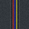
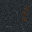
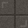
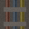
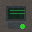
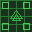
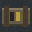

# Last Light Odyssey - Game Design Document
**Version 2.0 | Engine: Godot 4.6 | Last Updated: February 2026**

> *"The last journey of the human race isn't a hero's quest; it's a survival marathon."*

---

## Table of Contents
1. [Project Overview](#1-project-overview)
2. [The Management Layer](#2-the-management-layer-the-trail)
3. [The Tactical Layer](#3-the-tactical-layer-the-search)
4. [The Pressure Mechanic](#4-the-oregon-trail-pressure-mechanic)
5. [Win/Loss Conditions](#5-winloss-logic)
6. [Visual & Audio Direction](#6-visual--audio-direction)
7. [Implementation Status](#7-implementation-status)
8. [Next Steps & Roadmap](#8-next-steps--roadmap)

---

## 1. Project Overview

### Concept
A space-faring survival manager inspired by **The Oregon Trail**, featuring **Fallout 1/2 style** isometric tactical exploration. Players guide the last remnants of humanity across the stars, making desperate choices about when to scavenge, when to trade, and when to flee.

### Core Loop
```
Strategic Navigation → Random Event Resolution → Resource Scarcity → Tactical Scavenging → Repeat
```

### Platform Target
- **Primary**: PC (Mouse & Keyboard)
- **Resolution**: 1920x1080 (scaled to 1600x900 window)
- **Renderer**: GL Compatibility (for broad hardware support)

---

## 2. The Management Layer (The "Trail")

This layer simulates the grueling trek across the stars.

### 2.1 Primary Statistics

| Statistic | Starting Value | Description |
|-----------|----------------|-------------|
| **Colonists** | 1,000 | The player's "health" and final score. Humanity's last survivors. |
| **Fuel** | 10 | The clock. Each jump consumes fuel. At 0, ship enters "Drift Mode" (−20 colonists per jump). |
| **Ship Integrity** | 100% | Damaged by space hazards. At 0%, the ship is destroyed. Game Over. |
| **Scrap** | 0 | Currency found on tactical maps. Used for repairs and trading. |

### 2.2 The Star Map (Node System)

A procedurally generated node graph with **20 nodes** leading to New Earth.

**Structure:**
- 7 columns of nodes
- Variable nodes per column (2-4)
- Each node connects to 1-3 nodes in the next column
- Variable fuel costs per connection (1-3 fuel)

**Node Types:**

| Type | Frequency | Description |
|------|-----------|-------------|
| **Empty Space** | 40% | No tactical map, just a random event roll. |
| **Scavenge Site** | 40% | Triggers Isometric Tactical Mode for resource gathering. |
| **Trading Outpost** | 20% | Menu-based screen to trade Scrap for Fuel or repairs. |

### 2.3 Random Event System

Upon entering a node, the game rolls **1d10** against the Random Event Table.

**Current Events:**

| Roll | Event | Base Loss | Specialist | Mitigated Loss |
|------|-------|-----------|------------|----------------|
| 1 | Solar Flare | −50 colonists, −10% integrity | Tech | −10 colonists, 0% integrity |
| 2 | Meteor Shower | −30 colonists, −20% integrity | Scout | 0 colonists, −5% integrity |
| 3 | Disease Outbreak | −80 colonists | Medic | −20 colonists |
| 4 | System Malfunction | −20 colonists, −15% integrity | Tech | 0 colonists, −5% integrity |
| 5 | Pirate Ambush | −40 colonists, −25% integrity | Scout | −10 colonists, −10% integrity |
| 6 | Supply Cache | +2 fuel, +15 scrap | — | — |
| 7 | Distress Signal | +50 colonists, −10% integrity | Medic | +50 colonists, 0% integrity |
| 8 | Radiation Storm | −60 colonists, −5% integrity | Tech | −15 colonists |
| 9 | Cryo Pod Failure | −100 colonists | Medic | −30 colonists |
| 10 | Clear Skies | No effect | — | — |

**Resolution:** Events display narrative text. If the required specialist is alive, a "Mitigate" option becomes available.

---

## 3. The Tactical Layer (The "Search")

When the ship docks at a Scavenge Site, the game switches to isometric turn-based combat.

### 3.1 The Away Team

- Players select **3 Officers** to deploy
- **Permadeath**: Dead officers are removed permanently
- Losing a specialist disables their event mitigation options

### 3.2 Officer Archetypes

| Role | Passive Ability | Active Ability | HP | Move | Sight |
|------|-----------------|----------------|-----|------|-------|
| **Captain** | — | — | 100 | 5 | 6 |
| **Scout** | +2 sight range, extended enemy detection | **Overwatch** (1 AP): Reaction shot at first enemy that moves in LOS | 80 | 6 | 10 |
| **Tech** | Can see items through walls | **Breach** (1 AP): Destroy 1 tile of cover or wall | 70 | 4 | 5 |
| **Medic** | Can see exact enemy HP | **Patch** (2 AP): Heal adjacent ally for 50% max HP | 75 | 5 | 5 |

### 3.3 Combat System

**Turn Structure:**
- Unit-by-unit turn order (not side-based)
- Each officer acts in sequence, then all enemies act
- After all units act, a new round begins

**Action Point System:**
- Each unit has **2 AP** per round
- **Move**: 1 AP (distance up to move_range tiles)
- **Shoot**: 1 AP
- **Use Ability**: 1-2 AP (varies by ability)
- **Interact/Pickup**: Free (auto-pickup when stepping on items)

**Combat Calculations:**

```
Base Hit Chance = Class-based (varies by distance)
Adjacent (1 tile): 95%
Close (2 tiles): 90%
Medium (3-6 tiles): 50-85% (class-dependent)
Long (7+ tiles): 25-65% (class-dependent)

Cover Modifier:
  - Half Cover (crates): −25% hit chance
  - Full Cover (walls): −50% hit chance (if firing through)

Final Hit Chance = clamp(Base - Cover, 10%, 95%)
```

**Class Accuracy Profiles:**
- **Scout**: Best at long range (65% at 8+ tiles)
- **Captain**: Balanced (50% at 8+ tiles)
- **Tech/Medic**: Support-focused, weaker at range (40% at 8+ tiles)

### 3.4 Cover & Destruction

| Cover Type | Hit Penalty | Destructible |
|------------|-------------|--------------|
| Half Cover | −25% | Yes (destroyed by damage or Breach) |
| Full Cover | −50% | Yes (Tech's Breach ability only) |
| Walls | Blocks LOS | Some can be breached |

When cover is destroyed, it becomes rubble (0% cover value).

### 3.5 Fog of War

- Map starts blacked out
- Reveals in radius around each officer (sight_range)
- Enemies are only visible when in revealed areas AND within sight range

### 3.6 Enemy AI

**Behavior Priority:**
1. If target in range + LOS + has AP → **Shoot**
2. If target visible + has AP → **Move to tactical position**
3. Otherwise → **Idle**

**Tactical Position Scoring:**
- Ideal engagement range: 4-7 tiles
- Bonus for cover positions
- Bonus for maintaining LOS to targets
- Penalty for being too close or losing LOS

**Enemy Types:**

| Type | HP | Damage | Sight | Shoot Range | Spawn Rate |
|------|-----|--------|-------|-------------|------------|
| Basic | 50 | 20 | 6 | 8 | 80% |
| Heavy | 80 | 30 | 5 | 6 | 20% |

---

## 4. The "Oregon Trail" Pressure Mechanic

To prevent players from spending unlimited turns looting, the **Cryo-Stability Timer** creates urgency.

### Stability System

| Phase | Effect |
|-------|--------|
| **100%** | Mission start |
| **100% → 0%** | Decreases by **5%** every round |
| **0% (Collapse)** | "CRYO-FAILURE" warning displays |
| **Each round at 0%** | −10 colonists immediately |

### Extraction

- Extraction zone marked on map
- Mission ends when **all surviving officers** reach extraction tiles
- Resources collected during mission are added to ship totals upon extraction

---

## 5. Win/Loss Logic

### Win Condition
Reach the **"New Earth"** node (node 19) with **Colonists > 0**.

### Ending Tiers

| Colonists | Ending | Title |
|-----------|--------|-------|
| 1,000 | Perfect | "The Golden Age" |
| 500–999 | Good | "The Hard Foundation" |
| 1–499 | Bad | "The Endangered Species" |

### Loss Conditions

| Condition | Message |
|-----------|---------|
| Colonists = 0 | "EXTINCTION: Humanity's light has been extinguished." |
| Ship Integrity = 0% | "CATASTROPHIC FAILURE: The ship has been destroyed." |
| Captain dies | "LEADERSHIP LOST: Without leadership, the mission cannot continue." |

---

## 6. Visual & Audio Direction

### Art Style
- **Low-fidelity 2D sprites** with gritty color palette
- Dark grays, industrial oranges, neon blues
- Isometric tactical view (32×32 tile grid)

### UI Philosophy
- **Diegetic/Retro**: 1980s monochrome CRT terminal aesthetic
- Amber text on dark backgrounds
- Minimal, functional displays

---

### Sprite Assets

#### Officer Characters
The player's controllable units, each with distinct visual identity matching their role.

| Captain | Scout | Tech | Medic |
|:-------:|:-----:|:----:|:-----:|
|  |  |  |  |
| Command leader | Recon specialist | Engineer | Field medic |

#### Enemy Units
Hostile forces encountered during tactical missions.

| Basic Enemy | Heavy Enemy |
|:-----------:|:-----------:|
|  |  |
| Standard threat (80% spawn) | Armored threat (20% spawn) |

#### Unit Indicators
Visual feedback elements for unit states.

| Selection Ring | Shadow |
|:--------------:|:------:|
|  |  |
| Active unit indicator | Ground shadow for depth |

---

#### Interactable Objects
Items and cover objects found on tactical maps.

| Fuel Crate | Scrap Pile | Cover Crate | Destroyed Cover |
|:----------:|:----------:|:-----------:|:---------------:|
|  |  |  |  |
| +1 Fuel | +5 Scrap | Half cover (−25%) | Rubble (0% cover) |

---

#### Environment Tiles

**Floor Tiles**
| Panel | Grating | Cables | Damaged | Vent |
|:-----:|:-------:|:------:|:-------:|:----:|
|  |  |  |  |  |

**Wall Tiles**
| Solid Wall | Reinforced | Pipes | Terminal |
|:----------:|:----------:|:-----:|:--------:|
|  |  |  |  |

**Fog of War**
| Fog (Unexplored) | Fog Edge |
|:----------------:|:--------:|
|  |  |

**Overlays & Indicators**
| Grid Overlay | Movement Range | Attack Range | Hover |
|:------------:|:--------------:|:------------:|:-----:|
|  |  |  |  |

**Special Tiles**
| Extraction Zone | Half Cover | Space Background |
|:---------------:|:----------:|:----------------:|
|  |  |  |

---

#### Star Map Navigation Icons
Visual elements for the management layer star map.

| Asteroid Field | Trading Station | Earth (Goal) | Gas Planet | Red Planet |
|:--------------:|:---------------:|:------------:|:----------:|:----------:|
|  |  |  |  |  |
| Empty Space node | Trading Outpost | New Earth (Win) | Scavenge Site | Scavenge Site |

---

### Sound Design (Planned)
- Low ambient hums
- Metallic clangs for movement
- Piercing alarm when Cryo-Stability hits 0%
- UI feedback sounds for selections and actions

---

## 7. Implementation Status

### ✅ Phase 1: Core Systems (COMPLETE)
- [x] Global game state management (`GameState` autoload)
- [x] Primary statistics tracking with signals
- [x] Win/loss condition checking
- [x] Officer roster with alive/deployed states
- [x] Jump logic with fuel consumption and drift mode

### ✅ Phase 2: Star Map & Events (COMPLETE)
- [x] Procedural star map generator (7 columns, 2-4 nodes each)
- [x] Node connection system with variable fuel costs
- [x] Visual node graph with clickable navigation
- [x] Node type system (Empty, Scavenge, Trading)
- [x] Random event system with 10 events
- [x] Specialist mitigation for events
- [x] Event dialog UI

### ✅ Phase 3: Tactical Framework (COMPLETE)
- [x] Grid-based tilemap system (20×20)
- [x] A* pathfinding for movement
- [x] Point-and-click movement with path visualization
- [x] Fog of war with per-unit reveal radius
- [x] Interactable objects (Fuel Crates, Scrap Piles)
- [x] Auto-pickup system
- [x] Procedural map generation

### ✅ Phase 4: Combat System (COMPLETE)
- [x] Turn-based unit-by-unit system
- [x] Action Point management
- [x] Line-of-sight calculations (Bresenham's algorithm)
- [x] Cover system with hit chance modifiers
- [x] Class-based accuracy profiles
- [x] Shooting with hit/miss resolution
- [x] Damage calculation and HP bars
- [x] Enemy AI with tactical positioning
- [x] Enemy visibility tied to fog of war
- [x] Attackable target highlighting

### ✅ Phase 5: Specialist Abilities (COMPLETE)
- [x] Scout: Overwatch (reaction shots)
- [x] Tech: Breach (destroy cover/walls)
- [x] Medic: Patch (heal allies)
- [x] Ability buttons in HUD
- [x] AP cost validation

### ✅ Phase 6: Pressure Mechanic (COMPLETE)
- [x] Cryo-Stability bar and display
- [x] Stability drain per round (5%)
- [x] Colonist loss at 0% stability
- [x] Warning messages and visual feedback
- [x] Extraction zone system

### ✅ Phase 7: Visual Polish (PARTIAL)
- [x] Character sprites for all officer types
- [x] Enemy sprites (basic, heavy)
- [x] Environment tileset
- [x] Selection indicators and HP bars
- [x] Damage popup numbers
- [x] Combat camera focus during attacks
- [x] Projectile visual effects
- [x] Idle animations for units

### ⏳ Phase 8: UI & UX Polish (IN PROGRESS)
- [x] Tactical HUD with unit info
- [x] Management HUD with ship stats
- [x] Team selection dialog
- [x] Trading dialog
- [x] Event dialog with choices
- [ ] Title menu polish
- [ ] Settings/options menu
- [ ] Tutorial/help system

### ❌ Phase 9: Audio (NOT STARTED)
- [ ] Background ambient music
- [ ] UI sound effects
- [ ] Combat sound effects (shots, impacts)
- [ ] Alarm sounds for warnings
- [ ] Movement sounds

### ❌ Phase 10: Game Feel & Balance (NOT STARTED)
- [ ] Difficulty balancing
- [ ] Resource economy tuning
- [ ] Event frequency/impact balance
- [ ] Combat damage/accuracy tuning
- [ ] Save/Load system

---

## 8. Next Steps & Roadmap

### Immediate Priority (Week 1-2)

#### 1. Audio Foundation
- [ ] Implement background ambience for each game layer
- [ ] Add UI click/hover sounds
- [ ] Add weapon fire and impact sounds
- [ ] Add Cryo-Stability alarm sound
- [ ] Add movement footstep sounds

#### 2. Title Menu & Game Flow
- [ ] Polish title menu visuals (CRT aesthetic)
- [ ] Add New Game / Continue buttons
- [ ] Implement game-over screen with restart option
- [ ] Implement victory screen with ending text
- [ ] Add transition effects between scenes

#### 3. Trading System Enhancement
- [ ] Implement full trading mechanics (Scrap → Fuel)
- [ ] Add ship repair option (Scrap → Integrity)
- [ ] Visual trading interface with animated transactions

### Short-Term Goals (Week 3-4)

#### 4. Save/Load System
- [ ] Save game state to file (colonists, fuel, integrity, officers, node progress)
- [ ] Load game state on continue
- [ ] Auto-save at key moments (after jumps, after missions)

#### 5. Tutorial System
- [ ] Add first-time player guidance
- [ ] Tooltip system for UI elements
- [ ] Mission briefing before tactical deployment

#### 6. Visual Effects Polish
- [ ] Screen shake on damage
- [ ] Particle effects for explosions/impacts
- [ ] Enhanced fog of war transitions
- [ ] Animated tileset elements (flickering lights, steam vents)

### Medium-Term Goals (Month 2)

#### 7. Content Expansion
- [ ] Additional random events (expand to 20+)
- [ ] New enemy types (ranged, explosive, boss)
- [ ] Environmental hazards on tactical maps
- [ ] Special mission types (rescue, sabotage)

#### 8. Procedural Generation Improvements
- [ ] More map templates/themes
- [ ] Room-based generation for interior maps
- [ ] Loot distribution balancing
- [ ] Enemy placement variety

#### 9. Officer System Expansion
- [ ] Recruit new officers at trading posts
- [ ] Officer experience/leveling (optional)
- [ ] Unique officer traits/perks
- [ ] Officer equipment system

### Long-Term Goals (Month 3+)

#### 10. Advanced Features
- [ ] Multiple difficulty modes
- [ ] Endless/roguelike mode
- [ ] Achievement system
- [ ] Statistics tracking (missions completed, enemies killed, etc.)
- [ ] Controller support

#### 11. Story & Narrative
- [ ] "Captain's Log" intro sequence
- [ ] Story events tied to specific nodes
- [ ] Character interactions/dialogue
- [ ] Multiple ending variants based on decisions

---

## Development Notes

### File Structure
```
Last Light Odyssey/
├── assets/
│   ├── audio/          # Sound effects and music (TODO)
│   ├── fonts/          # Custom fonts
│   └── sprites/        # All game graphics
│       ├── characters/ # Officer and enemy sprites
│       ├── environment/# Tiles, cover, fog
│       ├── navigation/ # Star map elements
│       ├── objects/    # Interactables
│       └── terrain/    # Ground tiles
├── docs/
│   └── GAME_DESIGN_DOCUMENT.md  # This file
├── resources/
│   ├── events/         # Event data resources
│   └── officers/       # Officer data resources
├── scenes/
│   ├── management/     # Star map scenes
│   ├── tactical/       # Combat scenes
│   └── ui/             # Interface scenes
├── scripts/
│   ├── autoload/       # Global singletons
│   ├── management/     # Star map logic
│   ├── tactical/       # Combat logic
│   └── ui/             # Interface scripts
└── project.godot       # Godot project file
```

### Key Autoloads
- **GameState**: Global statistics, officer tracking, win/loss logic
- **EventManager**: Random events, node types, event resolution

### Design Philosophy
> *"Start with Gray Boxes."* Don't polish art until the mechanics feel fun. If the game is stressful and addictive with just squares and numbers, it will be a masterpiece once polish is added.

The core tension should come from:
1. **Resource scarcity** - Never enough fuel, always losing colonists
2. **Time pressure** - Cryo-Stability forces mission exits
3. **Meaningful choices** - Trade-offs between risk and reward
4. **Permanent consequences** - Dead officers stay dead

---

*Document maintained by the Last Light Odyssey development team.*
