# Last Light Odyssey - Game Design Document
**Version 3.0 | Engine: Godot 4.6 | Last Updated: February 6, 2026**

> *"The last journey of the human race isn't a hero's quest; it's a survival marathon."*

---

## Table of Contents
1. [Project Overview](#1-project-overview)
2. [The Management Layer](#2-the-management-layer-the-trail)
3. [The Tactical Layer](#3-the-tactical-layer-the-search)
4. [The Pressure Mechanic](#4-the-oregon-trail-pressure-mechanic)
5. [Win/Loss Conditions](#5-winloss-logic)
6. [Visual & Audio Direction](#6-visual--audio-direction)
7. [Implementation Status](#7-implementation-status)
8. [Next Steps & Roadmap](#8-next-steps--roadmap)

---

## 1. Project Overview

### Concept
A space-faring survival manager inspired by **The Oregon Trail**, featuring **Fallout 1/2 style** isometric tactical exploration. Players guide the last remnants of humanity across the stars, making desperate choices about when to scavenge, when to trade, and when to flee.

### Core Loop
```
Strategic Navigation → Random Event Resolution → Resource Scarcity → Tactical Scavenging → Repeat
```

### Platform Target
- **Primary**: PC (Mouse & Keyboard)
- **Resolution**: 1920x1080 (scaled to 1600x900 window)
- **Renderer**: GL Compatibility (for broad hardware support)

---

## 2. The Management Layer (The "Trail")

This layer simulates the grueling trek across the stars.

### 2.1 Primary Statistics

| Statistic | Starting Value | Description |
|-----------|----------------|-------------|
| **Colonists** | 1,000 | The player's "health" and final score. Humanity's last survivors. |
| **Fuel** | 10 | The clock. Each jump consumes fuel. At 0, ship enters "Drift Mode" (−40 colonists per fuel deficit). |
| **Ship Integrity** | 100% | Damaged by space hazards. At 0%, the ship is destroyed. Game Over. |
| **Scrap** | 0 | Currency found on tactical maps. Used for repairs and trading. |

### 2.2 The Star Map (Node System)

A procedurally generated node graph with **50 nodes** leading to New Earth.

**Structure:**
- 16 columns of nodes with layout: [1, 2, 3, 4, 4, 4, 4, 4, 4, 4, 3, 4, 3, 3, 2, 1] = 50 total nodes
- Each node connects to 1-3 nodes in adjacent columns (forward connections primary, backward connections at 30% chance)
- Variable fuel costs: base 2 fuel, +2 for row distance (diagonal/vertical movement), +4 for backward travel
- Fuel costs are calculated per connection and saved with the star map
- If insufficient fuel for a jump, ship enters "Drift Mode" and loses 40 colonists per fuel deficit
- **Navigation Penalties**: Each jump causes −1% ship integrity and −2% cryo-stability (harsh but necessary for tension)

**Node Types:**

| Type | Frequency | Description |
|------|-----------|-------------|
| **Empty Space** | 40% | No tactical map, just a random event roll. |
| **Scavenge Site** | 40% | Triggers Isometric Tactical Mode for resource gathering. Biome type pre-assigned. |
| **Trading Outpost** | 20% | Menu-based screen to trade Scrap for Fuel (10→1) or repairs (15→10%). |

### 2.3 Random Event System

Upon entering a node, the game rolls **1d10** against the Random Event Table.

**Current Events:**

| Roll | Event | Base Loss | Specialist | Mitigated Loss |
|------|-------|-----------|------------|----------------|
| 1 | Solar Flare | −50 colonists, −10% integrity | Tech | −10 colonists, 0% integrity |
| 2 | Meteor Shower | −30 colonists, −20% integrity | Scout | 0 colonists, −5% integrity |
| 3 | Disease Outbreak | −80 colonists | Medic | −20 colonists |
| 4 | System Malfunction | −20 colonists, −15% integrity | Tech | 0 colonists, −5% integrity |
| 5 | Pirate Ambush | −40 colonists, −25% integrity | Heavy | −10 colonists, −10% integrity |
| 6 | Supply Cache | +2 fuel, +15 scrap | — | — |
| 7 | Distress Signal | +50 colonists, −10% integrity | Medic | +50 colonists, 0% integrity |
| 8 | Radiation Storm | −60 colonists, −5% integrity | Tech | −15 colonists |
| 9 | Cryo Pod Failure | −100 colonists | Medic | −30 colonists |
| 10 | Clear Skies | No effect | — | — |

**Resolution:** Events display narrative text. If the required specialist is alive, a "Mitigate" option becomes available.

---

## 3. The Tactical Layer (The "Search")

When the ship docks at a Scavenge Site, the game switches to isometric turn-based combat.

### 3.1 The Away Team

- Players select **3 Officers** from a roster of 6 (Captain, Scout, Tech, Medic, Heavy, Sniper)
- **Permadeath**: Dead officers are removed permanently
- Losing a specialist disables their event mitigation options

### 3.2 Officer Archetypes

| Role | Passive Ability | Active Ability | HP | Move | Sight |
|------|-----------------|----------------|-----|------|-------|
| **Captain** | — | **Execute** (1 AP): Guaranteed kill on enemy within 4 tiles below 50% HP. Never misses. 2-turn cooldown. | 100 | 5 | 6 |
| **Scout** | +2 sight range, extended enemy detection | **Overwatch** (1 AP): Reaction shot at first enemy that moves in LOS. Guaranteed hit. 2-turn cooldown. | 80 | 6 | 10 |
| **Tech** | Can see items through walls | **Turret** (1 AP): Deploy auto-firing sentry on adjacent tile. Lasts 3 turns, auto-shoots nearest enemy each turn (15 DMG, 6 tile range). 2-turn cooldown. | 70 | 4 | 5 |
| **Medic** | Can see exact enemy HP | **Patch** (2 AP): Heal adjacent ally for 50% max HP. 2-turn cooldown. | 75 | 5 | 5 |
| **Heavy** | Armor Plating (−20% damage taken), +35 base damage | **Charge** (1 AP): Rush enemy within 4 tiles. Instant-kills basic enemies; deals 2x base damage to heavy enemies. 2-turn cooldown. | 120 | 3 | 5 |
| **Sniper** | +2 sight range, +2 shoot range, +30 base damage | **Precision Shot** (1 AP): Guaranteed hit on enemy 8+ tiles away. Deals 2x base damage (60). 2-turn cooldown. | 70 | 4 | 9 |

### 3.3 Combat System

**Turn Structure:**
- Unit-by-unit turn order (not side-based)
- Each officer acts in sequence, then all enemies act
- After all units act, a new round begins

**Action Point System:**
- Each unit has **2 AP** per round
- **Move**: 1 AP (distance up to move_range tiles)
- **Shoot**: 1 AP
- **Use Ability**: 1-2 AP (varies by ability)
- **Interact/Pickup**: Free (auto-pickup when stepping on items)

**Combat Calculations:**

```
Base Hit Chance = Class-based (varies by distance)
Adjacent (1 tile): 95%
Close (2 tiles): 90%
Medium (3-6 tiles): 50-85% (class-dependent)
Long (7+ tiles): 25-65% (class-dependent)

Defender Cover Modifier (reduces attacker's hit chance):
  - Half Cover (crates): −25% hit chance
  - Full Cover (walls): −50% hit chance

Attacker Cover Bonus (stable firing position):
  - Half Cover: +10% hit chance
  - Full Cover: +15% hit chance

Flanking Bonus:
  - Attacking from unprotected angle: +50% DAMAGE
  - Cover only protects from the direction it faces

Final Hit Chance = clamp(Base - DefenderCover + AttackerBonus, 10%, 95%)
```

**Class Accuracy Profiles:**
- **Sniper**: Best long-range accuracy (65% at 10+ tiles, 70% at 8-10 tiles), slightly weaker at close range (85% at 2-4 tiles)
- **Scout**: Excellent at long range (65% at 8+ tiles)
- **Captain**: Balanced (50% at 8+ tiles)
- **Heavy**: Good close-mid range, weaker at distance (45% at 8+ tiles), 35 base damage
- **Tech/Medic**: Support-focused, weaker at range (40% at 8+ tiles)

### 3.4 Cover & Destruction

| Cover Type | Defender Penalty | Attacker Bonus | Destructible |
|------------|------------------|----------------|--------------|
| Half Cover | −25% to hit | +10% accuracy | Yes |
| Full Cover | −50% to hit | +15% accuracy | Yes |
| Walls | Blocks LOS | — | Some destructible |

When cover is destroyed, it becomes rubble (0% cover value).

**Flanking System:**
Cover only protects from the direction it faces. Attacking from an unprotected angle (flanking) bypasses cover AND deals **+50% bonus damage**. Tactical positioning is crucial!

### 3.5 Specialist Abilities Detail

#### Turret System (Tech Ability)
Tech officers can deploy **auto-firing sentry turrets** on tactical maps:

- **Placement**: Adjacent tile only, must be walkable and unoccupied
- **Duration**: 3 turns (auto-expires after 3 enemy turns)
- **Auto-Fire**: Each turn, turret automatically targets and shoots the nearest visible enemy within range
- **Range**: 6 tiles (Manhattan distance)
- **Damage**: 15 per shot (always hits)
- **Cooldown**: 2-turn cooldown after deployment
- **Visual Feedback**: Turret displays remaining turns with color-coded indicator

#### Charge System (Heavy Ability)
Heavy officers can **rush enemies** in close combat:

- **Range**: 4 tiles (Manhattan distance)
- **Movement**: Heavy automatically moves adjacent to target (if path exists)
- **Basic Enemies**: Instant kill on contact
- **Heavy Enemies**: Deals 2x base damage (70 damage from Heavy's 35 base damage)
- **Cooldown**: 2-turn cooldown after use
- **Visual**: Cinematic melee attack animation with camera focus

#### Execute System (Captain Ability)
Captains can **finish off weakened enemies** with precision:

- **Range**: 4 tiles (Manhattan distance)
- **Requirement**: Target must be below 50% HP
- **Effect**: Guaranteed instant kill (deals damage equal to target's current HP)
- **Accuracy**: Never misses (bypasses all cover and hit chance calculations)
- **Cooldown**: 2-turn cooldown after use
- **Visual**: Cinematic execution sequence with camera focus

#### Precision Shot System (Sniper Ability)
Snipers can **deliver devastating long-range shots** with perfect accuracy:

- **Range**: 8-12 tiles (Manhattan distance) - requires minimum 8 tiles distance
- **Requirement**: Target must be 8+ tiles away and within line of sight
- **Effect**: Guaranteed hit dealing 2x base damage (60 damage from 30 base damage)
- **Accuracy**: Never misses (bypasses all cover and hit chance calculations)
- **Cooldown**: 2-turn cooldown after use
- **Visual**: Cinematic precision aiming sequence with camera focus, "TAKING AIM..." message

### 3.6 Fog of War

- Map starts blacked out
- Reveals in radius around each officer (sight_range)
- Enemies are only visible when in revealed areas AND within sight range

### 3.7 Enemy AI

**Smart AI Behavior Priority:**
1. If flanked (in ineffective cover) → **Reposition to effective cover**
2. If exposed (no cover) → **Move to cover position**
3. If target in range + LOS + has AP → **Shoot**
4. If target visible + has AP → **Move to tactical position**
5. Otherwise → **Idle**

**Tactical Position Scoring:**
- Ideal engagement range: 4-7 tiles
- High bonus for cover that protects from current threats
- Bonus for maintaining LOS to targets
- Penalty for being too close or losing LOS
- Repositions when flanked to find effective cover

**Heavy Charge Ability:**
- Heavy can rush enemies within 4 tiles
- Instant-kills basic enemies on contact
- Deals double base damage (70) to heavy enemies
- Heavy has 35 base damage (increased from standard 25)

**Enemy Types:**

| Type | HP | Damage | AP | Move | Sight | Shoot Range | Overwatch Range | Base Spawn |
|------|-----|--------|-----|------|-------|-------------|-----------------|------------|
| Basic | 50 | 20 | 2 | 4 | 6 | 8 | 0 | 70-80% |
| Heavy | 80 | 35 | 3 | 3 | 5 | 6 | 0 | 20-30% |
| Sniper | 40 | 30 | 2 | 5 | 10 | 12 | 5 | Rare (difficulty-based) |
| Elite | 100 | 40 | 3 | 4 | 7 | 9 | 0 | Rare (difficulty-based) |

*Note: Spawn rates vary by biome (see Section 3.7 Biome System). Sniper and Elite enemies appear more frequently as mission difficulty increases.*

### 3.8 Biome System

Scavenge sites have one of three procedurally-assigned biome types, each with unique map generation, visuals, and enemy distribution.

| Biome | Map Type | Size | Enemies | Heavy % | Loot Focus |
|-------|----------|------|---------|---------|------------|
| **Derelict Station** | BSP Rooms & Corridors | 25-30 | 4-6 | 30% | Balanced |
| **Asteroid Mine** | Cellular Automata Caves | 20-25 | 3-5 | 50% | More Scrap |
| **Planetary Surface** | Open Field w/ Clusters | 35-40 | 5-8 | 20% | More Fuel |

**Generation Algorithms:**
- **Station**: Binary Space Partitioning creates interconnected rooms with corridors. Industrial aesthetic with metal floors and walls.
- **Asteroid**: Cellular automata generates organic cave networks. Rocky browns with tighter spaces and high-value scrap deposits.
- **Planet**: Open terrain with scattered obstacle clusters and cover. Alien teal/purple aesthetic with bioluminescent elements.

**Biome Assignment:**
- Biomes are pre-assigned to scavenge nodes during star map generation
- Variety balancing ensures all three biome types appear across the journey
- Each biome has distinct visual themes and color palettes

### 3.9 Mission Difficulty Scaling

The game implements a dynamic difficulty system that scales mission challenges based on player progress through the star map.

**Difficulty Formula:**
- Base difficulty: 1.0x at node 0 (start)
- Scaling factor: 1.5x multiplier applied based on progress ratio
- Final difficulty: ~2.5x at node 49 (near end)
- **Final Stage Reduction**: Nodes 35+ (final 15 nodes) have reduced scaling (40% reduction) to prevent excessive difficulty spikes

**Difficulty Effects:**
- **Enemy Count**: Scaled by difficulty multiplier (capped at 2x base, hard cap at 15 enemies)
- **Heavy Enemy Spawn Chance**: Increases with difficulty (base chance + (difficulty - 1.0) × 0.3)
- **Sniper/Elite Enemies**: More likely to spawn in higher difficulty missions

**Balancing Philosophy:**
- Early missions (nodes 0-20): Learning phase, moderate challenge
- Mid missions (nodes 21-34): Increasing difficulty, tactical depth required
- Final missions (nodes 35-49): Reduced scaling prevents frustration while maintaining challenge

---

## 4. The "Oregon Trail" Pressure Mechanic

To prevent players from spending unlimited turns looting, the **Cryo-Stability Timer** creates urgency.

### Stability System

| Phase | Effect |
|-------|--------|
| **100%** | Mission start |
| **100% → 0%** | Decreases by **5%** every round (reduced to **3%** in final stages - nodes 35+) |
| **0% (Collapse)** | "CRYO-FAILURE" warning displays |
| **Each round at 0%** | −10 colonists immediately |

**Final Stage Balancing:** In nodes 35+ (final 15 nodes), stability loss per turn is reduced by 2% (from 5% to 3%) to give players more tactical turns in the critical final stretch.

### Extraction

- Extraction zone marked on map
- Mission ends when **all surviving officers** reach extraction tiles
- Resources collected during mission are added to ship totals upon extraction

### Mission Abort

Players can pause during tactical missions and choose to **Abandon Mission**:
- Costs **20 colonists** as penalty
- All deployed officers return safely (even if surrounded)
- No resources are gained from the mission
- Useful when a mission goes badly wrong

---

## 5. Win/Loss Logic

### Win Condition
Reach the **"New Earth"** node (node 19) with **Colonists > 0**.

### Ending Tiers

| Colonists | Ending | Title |
|-----------|--------|-------|
| 1,000 | Perfect | "The Golden Age" |
| 500–999 | Good | "The Hard Foundation" |
| 1–499 | Bad | "The Endangered Species" |

### Voyage Recap Screen
Upon reaching New Earth, players are shown a comprehensive **Voyage Recap** screen displaying:
- **Final State**: Colonists remaining, fuel reserves, ship integrity, scrap stockpile
- **Officer Status**: Survival status for all 6 officers (alive or K.I.A.)
- **Cumulative Statistics** (tracked across entire voyage):
  - Total fuel collected from missions
  - Total scrap collected from missions
  - Total hostiles eliminated
  - Missions completed
  - Tactical turns survived
  - Sectors traversed (nodes visited)

### Loss Conditions

| Condition | Message |
|-----------|---------|
| Colonists = 0 | "EXTINCTION: Humanity's light has been extinguished." |
| Ship Integrity = 0% | "CATASTROPHIC FAILURE: The ship has been destroyed." |
| Captain dies | "LEADERSHIP LOST: Without leadership, the mission cannot continue." |

---

## 6. Visual & Audio Direction

### Art Style
- **Low-fidelity 2D sprites** with gritty color palette
- Dark grays, industrial oranges, neon blues
- Isometric tactical view (32×32 tile grid)

### UI Philosophy
- **Diegetic/Retro**: 1980s monochrome CRT terminal aesthetic
- Amber text on dark backgrounds
- Minimal, functional displays

### Tutorial System
First-time players receive a **9-step guided tutorial** that covers:

1. **Star Map Navigation** - How to plot course and fuel costs
2. **Resource Management** - Understanding colonists, fuel, hull, and scrap
3. **Random Events** - How events work and specialist mitigation
4. **Scavenge Missions** - Team selection and permadeath warning
5. **Tactical Movement** - Action points and movement
6. **Combat** - Attacking enemies and cover mechanics
7. **Abilities** - Specialist unique abilities (Scout Overwatch, Tech Turret, Medic Patch, Heavy Charge, Captain Execute, Sniper Precision Shot)
8. **Cryo-Stability** - Time pressure and colonist loss
9. **Extraction** - Completing missions

Tutorial can be skipped at any time and reset from the Settings menu.

---

### Sprite Assets

**Status: COMPLETE** - All unit sprites, environment tiles, UI icons, and visual assets are implemented and in use.

#### Officer Characters
The player's controllable units, each with distinct visual identity matching their role.

| Captain | Scout | Tech | Medic | Heavy | Sniper |
|:-------:|:-----:|:----:|:-----:|:-----:|:------:|
|  |  |  |  |  |  |
| Command leader | Recon specialist | Engineer | Field medic | Tank/Defender | Long-range marksman |

#### Enemy Units
Hostile forces encountered during tactical missions.

| Basic Enemy | Heavy Enemy | Sniper Enemy | Elite Enemy |
|:-----------:|:-----------:|:------------:|:----------:|
|  |  |  |  |
| Standard threat (70-80% spawn) | Armored threat (20-30% spawn) | Long-range threat (difficulty-based) | Elite threat (difficulty-based) |

#### Unit Indicators
Visual feedback elements for unit states.

| Selection Ring | Shadow | Turret |
|:--------------:|:------:|:------:|
|  |  |  |
| Active unit indicator | Ground shadow for depth | Tech officer deployable sentry |

---

#### Interactable Objects
Items and cover objects found on tactical maps.

| Fuel Crate | Scrap Pile | Cover Crate | Destroyed Cover |
|:----------:|:----------:|:-----------:|:---------------:|
|  |  |  |  |
| +1 Fuel | +5 Scrap | Half cover (−25%) | Rubble (0% cover) |

---

#### Environment Tiles

**Floor Tiles**
| Panel | Grating | Cables | Damaged | Vent |
|:-----:|:-------:|:------:|:-------:|:----:|
|  |  |  |  |  |

**Wall Tiles**
| Solid Wall | Reinforced | Pipes | Terminal |
|:----------:|:----------:|:-----:|:--------:|
|  |  |  |  |

**Fog of War**
| Fog (Unexplored) | Fog Edge |
|:----------------:|:--------:|
|  |  |

**Overlays & Indicators**
| Grid Overlay | Movement Range | Attack Range | Hover |
|:------------:|:--------------:|:------------:|:-----:|
|  |  |  |  |

**Special Tiles**
| Extraction Zone | Half Cover | Space Background | Tileset Atlas |
|:---------------:|:----------:|:----------------:|:-------------:|
|  |  |  | 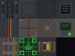 |

---

#### Terrain Tiles (Procedural Map Generation)

Additional tile variants used for procedural tactical map generation.

**Floor Variants**
| Metal 1 | Metal 2 | Metal Rusty | Concrete 1 | Concrete 2 | Dirt | Tiles |
|:-------:|:-------:|:-----------:|:----------:|:----------:|:----:|:-----:|
| 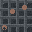 |  | 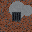 |  | 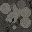 | 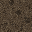 | 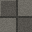 |

**Wall Variants**
| Metal | Concrete | Border | Debris |
|:-----:|:--------:|:------:|:------:|
| 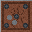 | 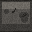 |  | 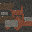 |

**Cover Variants**
| Crate Cover | Barrier Cover |
|:-----------:|:-------------:|
| 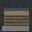 |  |

**Decorations & Details**
| Floor Grime | Cracks | Debris | Wires | Blood |
|:-----------:|:------:|:------:|:-----:|:-----:|
| 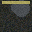 |  | 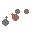 | 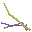 |  |

**Fog of War (Terrain)**
| Fog Full | Fog Edge |
|:--------:|:--------:|
|  |  |

**Tile Highlights**
| Grid Overlay | Movement | Attack | Hover |
|:------------:|:--------:|:------:|:-----:|
|  |  |  |  |

**Extraction Zone (Terrain)**
| Extraction Tile | Extraction Glow |
|:---------------:|:---------------:|
|  |  |

**Ambient Effects**
| Dust Particles | Smoke | Vignette |
|:--------------:|:-----:|:--------:|
|  |  |  |

---

#### Star Map Navigation Icons
Visual elements for the management layer star map.

| Asteroid Field | Trading Station | Earth (Goal) | Gas Planet | Red Planet |
|:--------------:|:---------------:|:------------:|:----------:|:----------:|
|  |  |  |  |  |
| Empty Space node | Trading Outpost | New Earth (Win) | Scavenge Site | Scavenge Site |

---

#### UI Icons
Interface icons used throughout the game for resource displays, actions, and settings.

**Resource Icons**
| Colonists | Fuel | Hull | Scrap | Cryo Stability |
|:---------:|:----:|:----:|:-----:|:--------------:|
|  |  |  |  |  |

**Combat Icons**
| Health | Action Points | Movement | Attack | Cover |
|:------:|:-------------:|:--------:|:------:|:-----:|
|  |  |  |  |  |

**System Icons**
| Turn | Enemies | Display | Audio | Tutorial |
|:----:|:-------:|:-------:|:-----:|:--------:|
|  |  |  |  |  |

---

### Sound Design (IMPLEMENTED)

**Audio System:**
- **AudioManager** autoload singleton with crossfading music system
- **Music Tracks**: Title ambient, Management ambient, Combat ambient (all looped)
- **SFX Pool**: 8-player pool for simultaneous sound effects
- **Audio Buses**: Master, Music, SFX with independent volume control (0-100%)
- **Volume Persistence**: Settings saved to `user://settings.cfg`

**Sound Effects:**
- **UI**: Click, hover, dialog open/close, end turn, transition
- **Combat**: Fire, hit, miss, overwatch, turret fire, heal, charge, execute, precision shot, damage, death, enemy alert
- **Alarms**: Cryo alarm, game over, victory
- **Movement**: Footstep, extraction beam, jump warp

**Music Crossfading**: Smooth transitions between tracks with 1-second fade duration

---

## 7. Implementation Status

### ✅ Phase 1: Core Systems (COMPLETE)
- [x] Global game state management (`GameState` autoload)
- [x] Primary statistics tracking with signals
- [x] Win/loss condition checking
- [x] Officer roster with alive/deployed states
- [x] Jump logic with fuel consumption and drift mode

### ✅ Phase 2: Star Map & Events (COMPLETE)
- [x] Procedural star map generator (9 columns, 20 total nodes)
- [x] Node connection system with variable fuel costs
- [x] Visual node graph with clickable navigation
- [x] Node type system (Empty, Scavenge, Trading)
- [x] Biome type pre-assignment for scavenge sites
- [x] Random event system with 10 events
- [x] Specialist mitigation for events (including Heavy)
- [x] Event dialog UI

### ✅ Phase 3: Tactical Framework (COMPLETE)
- [x] Grid-based tilemap system (variable size per biome)
- [x] A* pathfinding for movement
- [x] Point-and-click movement with path visualization
- [x] Fog of war with per-unit reveal radius
- [x] Interactable objects (Fuel Crates, Scrap Piles)
- [x] Auto-pickup system
- [x] Procedural map generation with three biome types
- [x] BSP room generation (Station biome)
- [x] Cellular automata cave generation (Asteroid biome)
- [x] Open field generation (Planet biome)

### ✅ Phase 4: Combat System (COMPLETE)
- [x] Turn-based unit-by-unit system
- [x] Action Point management
- [x] Line-of-sight calculations (Bresenham's algorithm)
- [x] Cover system with hit chance modifiers
- [x] Flanking system with directional cover
- [x] Class-based accuracy profiles
- [x] Shooting with hit/miss resolution
- [x] Damage calculation and HP bars
- [x] Smart Enemy AI with flanking awareness and repositioning
- [x] Enemy visibility tied to fog of war
- [x] Attackable target highlighting with hit chance display
- [x] Cover indicators on units showing protection level

### ✅ Phase 5: Specialist Abilities (COMPLETE)
- [x] Scout: Overwatch (reaction shots, guaranteed hit)
- [x] Tech: Turret (deploy auto-firing sentry, 3 turns)
- [x] Medic: Patch (heal allies)
- [x] Heavy: Charge (rush and devastate enemies)
- [x] Heavy: Armor Plating passive (20% damage reduction)
- [x] Heavy: Increased base damage (35 vs standard 25)
- [x] Captain: Execute (guaranteed kill on low-HP enemies)
- [x] Ability cooldown system (2-turn cooldown after use)
- [x] Ability buttons in HUD
- [x] AP cost validation

### ✅ Phase 6: Pressure Mechanic (COMPLETE)
- [x] Cryo-Stability bar and display
- [x] Stability drain per round (5%)
- [x] Colonist loss at 0% stability
- [x] Warning messages and visual feedback
- [x] Extraction zone system

### ✅ Phase 7: Visual Polish (COMPLETE)
- [x] Character sprites for all officer types
- [x] Enemy sprites (basic, heavy, sniper, elite)
- [x] Environment tileset
- [x] Selection indicators and HP bars
- [x] Damage popup numbers
- [x] Combat camera focus during attacks
- [x] Projectile visual effects
- [x] Idle animations for units
- [x] Cover indicators (half/full cover visual feedback)
- [x] Hit chance display on targetable enemies
- [x] Biome-specific visual themes and backgrounds

### ✅ Phase 8: UI & UX Polish (COMPLETE)
- [x] Tactical HUD with unit info
- [x] Management HUD with ship stats
- [x] Team selection dialog
- [x] Trading dialog with fuel purchase and hull repair
- [x] Event dialog with choices
- [x] Title menu with animated starfield, typewriter subtitle, and polish
- [x] Settings menu (display, audio sliders, tutorial reset)
- [x] Tutorial system with 9-step guided onboarding
- [x] Pause menu with abandon mission option
- [x] Confirmation dialog for destructive actions
- [x] Game over and victory screens with ending text
- [x] Restart game functionality

### ✅ Phase 9: Save/Load System (COMPLETE)
- [x] Save game state to JSON file (colonists, fuel, integrity, scrap, officers)
- [x] Save star map layout and node progress
- [x] Save node types and biome assignments
- [x] Save cumulative mission statistics (fuel collected, scrap collected, enemies killed, missions completed, tactical turns)
- [x] Load game state on continue
- [x] Continue button on title menu (disabled if no save)
- [x] New game confirmation dialog when save exists
- [x] Delete save functionality
- [x] Settings persistence (display, audio, tutorial state)

### ✅ Phase 10: Audio (COMPLETE)
- [x] AudioManager autoload singleton with crossfading music system
- [x] Background ambient music (title, management, combat tracks)
- [x] UI sound effects (click, hover, dialog, transitions)
- [x] Combat sound effects (shots, impacts, abilities, death)
- [x] Alarm sounds for warnings (cryo, game over, victory)
- [x] Movement sounds (footsteps, extraction, jump)
- [x] Audio bus system (Master, Music, SFX)
- [x] Volume control and persistence
- [x] SFX pool system for simultaneous sounds

### ⏳ Phase 11: Game Feel & Balance (IN PROGRESS)
- [x] Mission difficulty scaling system (1.0x to ~2.5x based on progress)
- [x] Final stage balancing (reduced stability loss and difficulty scaling in nodes 35+)
- [x] Navigation penalties (ship integrity and stability loss per jump)
- [x] Drift mode penalty tuning (40 colonists per fuel deficit)
- [x] Fuel cost system refinement (base 2, +2 row distance, +4 backward)
- [ ] Fine-tuning event damage/impact balance
- [ ] Resource economy refinement (fuel costs, scrap drops)
- [ ] Combat damage/accuracy fine-tuning

---

## 8. Next Steps & Roadmap

### ✅ Recently Completed

#### Title Menu & Game Flow
- [x] Animated starfield background with 200 parallax stars
- [x] Typewriter subtitle animation ("The final journey of humanity begins")
- [x] Title glow pulsing effect
- [x] Button hover scale animations
- [x] New Game / Continue / Settings / Quit buttons
- [x] Continue button disabled when no save exists
- [x] Confirmation dialog for new game when save exists
- [x] Fade transitions between scenes
- [x] Game over screen with restart option
- [x] Victory screen with ending tier text

#### Save/Load System
- [x] Full game state persistence (colonists, fuel, integrity, scrap)
- [x] Officer status persistence (alive/deployed state)
- [x] Star map layout persistence (nodes, connections, types, fuel costs)
- [x] Node progress persistence (current node, visited nodes)
- [x] Continue game from title menu
- [x] Delete save when starting new game

#### Settings Menu
- [x] Display settings (fullscreen toggle, resolution: 720p/900p/1080p)
- [x] Audio volume sliders (Master, SFX, Music) - UI ready for Phase 10
- [x] Reset Tutorial button with visual feedback
- [x] Settings persistence to user://settings.cfg
- [x] Apply button with confirmation feedback

#### Tutorial System
- [x] TutorialManager autoload singleton
- [x] 9-step guided onboarding sequence
- [x] Tutorial overlay with animated prompts
- [x] Directional arrow indicators
- [x] Skip tutorial option
- [x] Tutorial state persistence
- [x] Reset tutorial from settings

#### Trading System Enhancement
- [x] Buy fuel: 10 scrap → 1 fuel
- [x] Repair hull: 15 scrap → 10% integrity
- [x] Status feedback on transactions
- [x] Button availability based on resources

#### Additional UI
- [x] Pause menu with abandon mission option (costs 20 colonists)
- [x] Reusable confirmation dialog component

#### Heavy Officer Class
- [x] New officer type: Heavy
- [x] Armor Plating passive ability (20% damage reduction)
- [x] Charge active ability (1 AP, rush enemy within 4 tiles, instant-kills basic enemies)
- [x] Increased base damage (35 vs standard 25)
- [x] 120 HP, 3 move range, 5 sight range
- [x] Heavy sprite and animations
- [x] Pirate Ambush event mitigation

#### Sniper Officer Class
- [x] New officer type: Sniper
- [x] Extended sight range (+2) and shoot range (+2) for long-range combat
- [x] Increased base damage (30 vs standard 25)
- [x] Precision Shot active ability (1 AP, guaranteed hit at 8+ tiles for 2x damage)
- [x] 70 HP, 4 move range, 9 sight range, 12 shoot range
- [x] Best long-range accuracy profile (65% at 10+ tiles)
- [x] Sniper sprite with hood and targeting monocle

#### Biome System
- [x] Three biome types: Station, Asteroid, Planet
- [x] BSP room generation for Station maps
- [x] Cellular automata cave generation for Asteroid maps
- [x] Open field generation with obstacle clusters for Planet maps
- [x] Biome-specific enemy counts and heavy spawn rates
- [x] Biome-specific loot distributions
- [x] Biome pre-assignment to scavenge nodes with variety balancing
- [x] Distinct visual themes and color palettes per biome

#### Smart Enemy AI
- [x] Flanking awareness - AI recognizes when cover is ineffective
- [x] Automatic repositioning when being flanked
- [x] Prioritizes finding cover that protects from threats
- [x] Evaluates cover effectiveness based on threat directions

#### Mission Difficulty Scaling
- [x] Dynamic difficulty multiplier based on node progress (1.0x at start, ~2.5x at end)
- [x] Reduced difficulty scaling in final stages (nodes 35+) for better balance
- [x] Enemy count scaling with difficulty multiplier
- [x] Heavy enemy spawn chance increases with difficulty

#### Navigation & Balance Improvements
- [x] Increased star map to 50 nodes (16 columns) for longer journey
- [x] Increased drift mode penalty to 40 colonists per fuel deficit (harsher consequences)
- [x] Navigation penalties: −1% ship integrity and −2% stability per jump
- [x] Updated fuel costs: base 2, +2 for row distance, +4 for backward travel
- [x] Final stage stability reduction (3% per turn instead of 5% in nodes 35+)

#### Specialist Abilities Expansion
- [x] Tech: Turret deployment system (replaces Breach ability)
- [x] Heavy: Charge melee attack system (replaces Taunt ability)
- [x] Captain: Execute instant-kill system (new ability)
- [x] Ability cooldown system (2-turn cooldown for all abilities)
- [x] Turret auto-fire system (processes before player actions each turn)
- [x] Charge pathfinding and melee animation
- [x] Execute targeting mode with range visualization

#### Combat System Enhancements
- [x] Hit chance display on targetable enemies
- [x] Cover indicators on units (half/full cover status)
- [x] Flanking damage bonus (+50%)
- [x] Attacker cover bonus (stable firing position)

#### Audio System
- [x] AudioManager autoload singleton with crossfading music system
- [x] Three music tracks: Title ambient, Management ambient, Combat ambient (all looped)
- [x] SFX pool system (8 players for simultaneous sounds)
- [x] Complete UI sound effects (click, hover, dialog open/close, end turn, transition)
- [x] Complete combat sound effects (fire, hit, miss, overwatch, turret, heal, charge, execute, precision, damage, death, alert)
- [x] Alarm sounds (cryo failure, game over, victory)
- [x] Movement sounds (footstep, extraction beam, jump warp)
- [x] Audio bus system (Master, Music, SFX) with independent volume control
- [x] Volume persistence to settings.cfg
- [x] Music crossfading with 1-second fade duration

### Immediate Priority (Week 1-2)

#### 1. Visual Effects Polish
- [ ] Screen shake on damage
- [ ] Particle effects for explosions/impacts
- [ ] Enhanced fog of war transitions
- [ ] Animated tileset elements (flickering lights, steam vents)

#### 2. Quality of Life Enhancements
- [ ] Auto-save after jumps and missions
- [ ] Tooltip system for UI elements
- [ ] Mission briefing before tactical deployment
- [ ] Keyboard shortcuts reference

### Short-Term Goals (Week 3-4)

#### 3. Game Balance Pass (Ongoing)
- [x] Mission difficulty scaling system implemented
- [x] Final stage balancing (reduced stability loss, difficulty scaling)
- [x] Navigation penalties tuned (ship integrity and stability loss per jump)
- [x] Drift mode penalty increased for harsher consequences
- [ ] Fine-tuning event damage/impact balance
- [ ] Resource economy refinement (fuel costs, scrap drops)
- [ ] Combat damage/accuracy fine-tuning

#### 4. Additional Enemy Types
- [x] Sniper enemy type (long-range, overwatch capability)
- [x] Elite enemy type (high HP, high damage)
- [x] Difficulty-based enemy spawning
- [ ] Additional enemy variants (explosive, boss types)

### Medium-Term Goals (Month 2)

#### 5. Content Expansion
- [ ] Additional random events (expand to 20+)
- [ ] Additional enemy variants (explosive, boss)
- [ ] Environmental hazards on tactical maps
- [ ] Special mission types (rescue, sabotage)

#### 6. Procedural Generation Improvements
- [ ] More map templates/themes
- [ ] Room-based generation for interior maps
- [ ] Loot distribution balancing
- [ ] Enemy placement variety

#### 7. Officer System Expansion
- [ ] Recruit new officers at trading posts
- [ ] Officer experience/leveling (optional)
- [ ] Unique officer traits/perks
- [ ] Officer equipment system

### Long-Term Goals (Month 3+)

#### 8. Advanced Features
- [ ] Multiple difficulty modes
- [ ] Endless/roguelike mode
- [ ] Achievement system
- [ ] Statistics tracking (missions completed, enemies killed, etc.)
- [ ] Controller support

#### 9. Story & Narrative
- [ ] "Captain's Log" intro sequence
- [ ] Story events tied to specific nodes
- [ ] Character interactions/dialogue
- [ ] Multiple ending variants based on decisions

---

## Development Notes

### File Structure
```
Last Light Odyssey/
├── assets/
│   ├── audio/          # Sound effects and music (TODO)
│   ├── fonts/          # Custom fonts
│   └── sprites/        # All game graphics
│       ├── characters/ # Officer and enemy sprites
│       ├── environment/# Tiles, cover, fog
│       ├── navigation/ # Star map elements
│       ├── objects/    # Interactables
│       └── terrain/    # Ground tiles
├── docs/
│   └── GAME_DESIGN_DOCUMENT.md  # This file
├── resources/
│   ├── events/         # Event data resources
│   └── officers/       # Officer data resources
├── scenes/
│   ├── management/     # Star map scenes
│   ├── tactical/       # Combat scenes
│   └── ui/             # Interface scenes
├── scripts/
│   ├── autoload/       # Global singletons (GameState, EventManager, TutorialManager)
│   ├── management/     # Star map logic, node generation
│   ├── tactical/       # Combat logic, map generation, enemy AI, biome config
│   └── ui/             # Interface scripts
└── project.godot       # Godot project file
```

### Key Autoloads
- **GameState**: Global statistics, officer tracking, win/loss logic, save/load system, mission difficulty scaling
- **EventManager**: Random events, node types, event resolution
- **TutorialManager**: Tutorial state, step progression, persistence
- **CombatRNG**: Centralized combat random number generation
- **AudioManager**: Music crossfading, SFX pool, bus volume control

### Key Classes
- **BiomeConfig**: Biome type definitions, color themes, enemy/loot configurations, difficulty scaling
- **MapGenerator**: Procedural map generation (BSP, caves, open fields)
- **StarMapGenerator**: Star map node graph generation (50 nodes, 16 columns) with biome assignment
- **EnemyAI**: Smart enemy behavior with flanking awareness and repositioning
- **AudioManager**: Music and SFX playback with crossfading and volume control

### Design Philosophy
> *"Start with Gray Boxes."* Don't polish art until the mechanics feel fun. If the game is stressful and addictive with just squares and numbers, it will be a masterpiece once polish is added.

The core tension should come from:
1. **Resource scarcity** - Never enough fuel, always losing colonists
2. **Time pressure** - Cryo-Stability forces mission exits
3. **Meaningful choices** - Trade-offs between risk and reward
4. **Permanent consequences** - Dead officers stay dead

---

*Document maintained by the Last Light Odyssey development team.*
