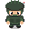
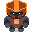
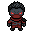
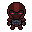
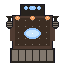
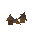
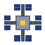

# Last Light Odyssey - Game Design Document
**Version 3.5 | Engine: Godot 4.6 | Last Updated: February 2026**

> *"The last journey of the human race isn't a hero's quest; it's a survival marathon."*

---

## Table of Contents
1. [Project Overview](#1-project-overview)
2. [The Management Layer](#2-the-management-layer-the-trail)
3. [The Tactical Layer](#3-the-tactical-layer-the-search)
4. [The Pressure Mechanic](#4-the-oregon-trail-pressure-mechanic)
5. [Win/Loss Conditions](#5-winloss-logic)
6. [Visual Direction](#6-visual-direction)
7. [Implementation Status](#7-implementation-status)
8. [Next Steps & Roadmap](#8-next-steps--roadmap)

---

## 1. Project Overview

### Concept
A space-faring survival manager inspired by **The Oregon Trail**, featuring **Fallout 1/2 style** isometric tactical exploration. Players guide the last remnants of humanity across the stars, making desperate choices about when to scavenge, when to trade, and when to flee.

### Core Loop
```
Infinite Exploration (Fuel) → Tactical Scavenging (Cash/Intel) → Officer Progression (XP/Tech) → Story Advancement
```

### Platform Target
- **Primary**: PC (Mouse & Keyboard)
- **Resolution**: 1920x1080 (scaled to 1600x900 window)
- **Renderer**: GL Compatibility (for broad hardware support)

---

## 2. The Management Layer (The "Voyage")

This layer simulates the command of the ship across an infinite procedurally generated star sector.

### 2.1 Economic & Survival Stats

The economy has been overhauled to support a non-linear "Voyage" loop.

| Statistic | Initial | Description |
|-----------|---------|-------------|
| **Fuel** | 10 | Ship Stamina. Consumed per jump (1-3 based on distance). At 0, applies Hull Damage. |
| **Scrap** | 25 | Material Resource. Used ONLY for: 1) Hull Repairs, 2) Event Mitigation. |
| **Hull Integrity** | 100.0 | Ship Health. At 0.0, trigger Game Over (Ship Destruction). |
| **Cash** | 100 | Liquid Assets. Primary currency. Used in the **Market** to buy Fuel/Scrap. |
| **Intel** | 0 | Story Progress. Gained from tactical missions. **Threshold of 10** spawns a Story Node. |
| **Data Logs** | 0 | Tech Currency. Shared resource used to purchase **Ability Tree** slots for Officers. |

### 2.2 The Infinite Map System

Replaces the linear "Oregon Trail" path with an **Infinite Grid System**.

**Structure:**
- **Coordinate-Based Generation**: The map is generated infinitely based on grid coordinates `Vector2(x, y)`.
- **Exploration Logic**: Players can move to any of the 6 adjacent hex coordinates (or 4 grid coordinates) relative to their position.
- **Node Discovery**: New nodes are generated as "Unvisited" when they come within range.
- **Backtracking**: Players can revisit nodes, but "Cleared" nodes become "Dead Zones" (traversable but offer no rewards).

**Node Types:**
| Type | Frequency | Description |
|------|-----------|-------------|
| **Scavenge Site** | 40% | Triggers Isometric Tactical Mode for resource gathering. |
| **Empty / Event** | 40% | No tactical map, triggers a Random Event roll. |
| **Story Node** | Dynamic | Spawns automatically when **Intel >= 10**. Advances the narrative. |

**Node States:**
1.  **UNVISITED**: Default state. Clickable. Enters Tactical Mode or Event.
2.  **CLEARED**: Set after mission success. Traversable but costs fuel with no reward.
3.  **STORY**: Special state. Overrides standard behavior for plot progression.

**Story Node Spawning:**
-   **Trigger**: When `GameState.intel >= 10`.
-   **Logic**: The system searches for an UNVISITED node within Range 3. If none, it generates one.
-   **Effect**: Forces that node to be a Story Mission. Completing it resets Intel to 0.

### 2.3 Random Event System

Upon entering an "Empty / Event" node, the game rolls **1d10** against the Event Table.

**Events:**
| Roll | Event | Base Loss | Specialist | Mitigated Loss | Mitigation Cost |
|------|-------|-----------|------------|----------------|-----------------|
| 1 | Solar Flare | −30% integrity | Tech | −10% integrity | 18 scrap |
| 2 | Meteor Shower | −40% integrity | Scout | −15% integrity | 22 scrap |
| 3 | System Critical | −25% integrity | Tech | −5% integrity | 15 scrap |
| 4 | Pirate Ambush | −50% integrity | Heavy | −20% integrity | 28 scrap |
| 5 | Space Debris | −20% integrity | Scout | −10% integrity | 20 scrap |
| 6 | Sensor Ghost | No effect | — | — | — |
| 7 | Radiation Storm | −35% integrity | Tech | −15% integrity | 25 scrap |
| 8 | Void Rift | −45% integrity | Scout | −20% integrity | 30 scrap |
| 9 | Hull Malfunction | −25% integrity | Tech | −10% integrity | 20 scrap |
| 10 | Clear Skies | No effect | — | — | — |

**Mitigation Cost Scaling:**
Costs scale with `GameState.total_jumps_made` to maintain economic pressure as the player accumulates wealth.

**Resolution:**
If the required specialist is **Alive** and **Available** (not injured), and the player has enough Scrap, they can mitigate the damage.

### 2.4 The Market System

Accessible from the Management HUD, the Market is the primary resource sink and bailout mechanic.

**Transactions:**
- **Buy Fuel**: 10 Cash → +5 Fuel
- **Buy Scrap**: 10 Cash → +10 Scrap
- **Repair Hull**: 50 Cash → +10% Integrity (Max 100%)

---

## 3. The Tactical Layer (The "Search")

 When the ship docks at a Scavenge Site, the game switches to isometric turn-based combat.

### 3.1 The Crew (OfficerData)

Refactored from a simple roster to a persistent RPG system.

**Officer Data Structure:**
- **Identity**: ID (e.g., "captain"), Class, Alive Status.
- **Progression**: Level (1-3), XP, Unlocked Abilities.
- **Health**: Persistent HP across jumps.
- **Status**: Injury Jumps (Cooldown if hurt).

### 3.2 Officer Classes & Abilities

**Base Archetypes:**
(Abilities listed here are *Base* abilities. Upgrades are unlocked via Tech Tree).

| Role | Passive Ability | Active Ability | HP | Move | Sight |
|------|-----------------|----------------|-----|------|-------|
| **Captain** | — | **Execute** (1 AP): Guaranteed kill on enemy within 4 tiles below 50% HP. Never misses. 2-turn cooldown. | 100 | 5 | 6 |
| **Scout** | +2 sight range (base 8 + 2 = 10), extended enemy detection | **Overwatch** (1 AP): Reaction shot at first enemy that moves in LOS. Guaranteed hit. 2-turn cooldown. | 80 | 6 | 10 |
| **Tech** | Can see items through walls | **Turret** (1 AP): Deploy auto-firing sentry on adjacent tile. Lasts 3 turns, auto-shoots nearest enemy each turn (15 DMG, 6 tile range). 2-turn cooldown. | 70 | 4 | 5 |
| **Medic** | Can see exact enemy HP, +25% healing bonus | **Patch** (1 AP): Heal yourself or ally within 3 tiles for 62.5% max HP (50% base + 25% enhanced healing). 2-turn cooldown. | 75 | 5 | 5 |
| **Heavy** | Armor Plating (−20% damage taken), +35 base damage | **Charge** (1 AP): Rush enemy within 4 tiles. Instant-kills basic enemies; deals 2x base damage to heavy enemies. 2-turn cooldown. | 120 | 3 | 5 |
| **Sniper** | +2 sight range (base 7 + 2 = 9), +2 shoot range, +30 base damage | **Precision Shot** (1 AP): Guaranteed hit on any visible enemy. Deals 2x base damage (60). 2-turn cooldown. | 70 | 4 | 9 |

### 3.3 Progression & Tech Tree (Barracks)

Officers gain XP from missions to unlock new tiers of abilities.

**XP Sources:**
- **Kills**: +30 XP (Killer).
- **Survival**: +60 XP (All living squad members).
- **Objective**: +45% XP Multiplier (if successful).

**Tech Tree Unlocks:**
Purchased with **XP** + **Data Logs** in the Barracks.
- **Level 2**: Requires 100 XP + 5 Data Logs. Unlocks Binary Choice (Trait A or B).
- **Level 3**: Requires 300 XP + 10 Data Logs. Unlocks Trinary Choice (Trait A, B, or C).

### 3.4 The Injury System

Officers taking significant damage are sidelined for recovery.

- **Trigger**: Tactical Mission ends with Officer HP < 50% (and Officer is Alive).
- **Effect**: Officer gains **2 Injury Jumps**. They cannot be selected for deployment.
- **Recovery**: -1 Injury Jump for every Voyage Jump made.

### 3.5 Combat System

**Turn Structure:**
- Unit-by-unit turn order (not side-based)
- Each officer acts in sequence, then all enemies act
- After all units act, a new round begins

**Action Point System:**
- Each unit has **2 AP** per round
- **Move**: 1 AP (distance up to move_range tiles). Units can pass through other units but cannot end their turn on an occupied tile.
- **Shoot**: 1 AP
- **Use Ability**: 1-2 AP (varies by ability)
- **Interact/Pickup**: Free (auto-pickup when stepping on items)

**Combat Calculations:**

```
Base Hit Chance = Class-based (varies by distance)
Adjacent (1 tile): 95%
Close (2 tiles): 90%
Medium (3-6 tiles): 50-85% (class-dependent)
Long (7+ tiles): 25-65% (class-dependent)

Defender Cover Modifier (reduces attacker's hit chance):
  - Half Cover (crates): −25% hit chance
  - Full Cover (walls): −50% hit chance

Attacker Cover Bonus (stable firing position):
  - Half Cover: +5% hit chance
  - Full Cover: +10% hit chance

Flanking Bonus:
  - Attacking from unprotected angle: +50% DAMAGE
  - Cover only protects from the direction it faces

Final Hit Chance = clamp(Base - DefenderCover + AttackerBonus, 20%, 95%)

**LOS Forgiveness:**
The Line of Sight algorithm includes "forgiveness" logic, allowing units to see slightly around corners and through adjacent cover to reduce frustration in tight tactical environments.
```

#### 3.5.1 Technical Hooks (Unit.gd)
The Unit class in the Tactical Layer supports dynamic modifiers based on unlocked officer abilities.

**Cooldown Modification:**
```gdscript
func get_ability_cooldown(ability_name: String) -> int:
    # Example: Captain Level 3 "Warlord"
    if ability_name == "Execute" and "warlord" in data.unlocked_abilities:
        return 0 # Cooldown removed
    return base_cooldown
```

**Damage Modification:**
```gdscript
func get_damage_modifier(target: Unit) -> float:
    # Example: Sniper Level 3 "Apex Predator"
    if "apex_predator" in data.unlocked_abilities and target.hp == target.max_hp:
        return 2.0 # Double damage vs full health
    return 1.0
```

**Class Accuracy Profiles:**
- **Sniper**: Best long-range accuracy (65% at 10+ tiles, 70% at 8-10 tiles), slightly weaker at close range (85% at 2-4 tiles)
- **Scout**: Excellent at long range (65% at 8+ tiles)
- **Captain**: Balanced (50% at 8+ tiles)
- **Heavy**: Good close-mid range, weaker at distance (45% at 8+ tiles), 35 base damage
- **Tech/Medic**: Support-focused, weaker at range (40% at 8+ tiles)

### 3.6 Cover & Destruction

| Cover Type | Defender Penalty | Attacker Bonus | Destructible |
|------------|------------------|----------------|--------------|
| Half Cover | −25% to hit | +10% accuracy | Yes |
| Full Cover | −50% to hit | +15% accuracy | Yes |
| Walls | Blocks LOS | — | Some destructible |

When cover is destroyed, it becomes rubble (0% cover value).

**Flanking System:**
Cover only protects from the direction it faces. Attacking from an unprotected angle (flanking) bypasses cover AND deals **+50% bonus damage**. Tactical positioning is crucial!

### 3.7 Specialist Abilities Detail

#### Turret System (Tech Ability)
Tech officers can deploy **auto-firing sentry turrets** on tactical maps:

- **Placement**: Adjacent tile only, must be walkable and unoccupied
- **Duration**: 3 turns (auto-expires after 3 enemy turns)
- **Auto-Fire**: Each turn, turret automatically targets and shoots the nearest visible enemy within range
- **Range**: 6 tiles (Manhattan distance)
- **Damage**: 15 per shot (always hits)
- **Cooldown**: 2-turn cooldown after deployment
- **Visual Feedback**: Turret displays remaining turns with color-coded indicator

#### Charge System (Heavy Ability)
Heavy officers can **rush enemies** in close combat:

- **Range**: 4 tiles (Manhattan distance)
- **Movement**: Heavy automatically moves adjacent to target (if path exists)
- **Basic Enemies**: Instant kill on contact
- **Heavy Enemies**: Deals 2x base damage (70 damage from Heavy's 35 base damage)
- **Cooldown**: 2-turn cooldown after use
- **Visual**: Cinematic melee attack animation with camera focus

#### Execute System (Captain Ability)
Captains can **finish off weakened enemies** with precision:

- **Range**: 4 tiles (Manhattan distance)
- **Requirement**: Target must be below 50% HP
- **Effect**: Guaranteed instant kill (deals damage equal to target's current HP)
- **Accuracy**: Never misses (bypasses all cover and hit chance calculations)
- **Cooldown**: 2-turn cooldown after use
- **Visual**: Cinematic execution sequence with camera focus

#### Precision Shot System (Sniper Ability)
Snipers can **deliver devastating long-range shots** with perfect accuracy:

- **Range**: Any visible enemy (no distance restriction)
- **Requirement**: Target must be visible (within revealed fog of war)
- **Effect**: Guaranteed hit dealing 2x base damage (60 damage from 30 base damage)
- **Accuracy**: Never misses (bypasses all cover and hit chance calculations)
- **Cooldown**: 2-turn cooldown after use
- **Visual**: Cinematic precision aiming sequence with camera focus, "TAKING AIM..." message

### 3.8 Fog of War

- Map starts blacked out
- Reveals in radius around each officer (sight_range)
- Enemies are only visible when in revealed areas AND within sight range

### 3.9 Enemy AI

**Smart AI Behavior Priority:**
1. If flanked (in ineffective cover) → **Reposition to effective cover**
2. If exposed (no cover) → **Move to cover position**
3. If target in range + LOS + has AP → **Shoot**
4. If target visible + has AP → **Move to tactical position** (Visible enemies prioritize using all available AP for movement or attacks).
5. Otherwise → **Idle**

**Tactical Position Scoring:**
- Ideal engagement range: 4-7 tiles
- High bonus for cover that protects from current threats
- Bonus for maintaining LOS to targets
- Penalty for being too close or losing LOS
- Repositions when flanked to find effective cover

**Heavy Charge Ability:**
- Heavy can rush enemies within 4 tiles
- Instant-kills basic enemies on contact
- Deals double base damage (70) to heavy enemies
- Heavy has 35 base damage (increased from standard 25)

**Enemy Types:**

| Type | HP | Damage | AP | Move | Sight | Shoot Range | Overwatch Range | Base Spawn |
|------|-----|--------|-----|------|-------|-------------|-----------------|------------|
| Basic | 50 | 20 | 2 | 4 | 6 | 8 | 0 | 70-80% |
| Heavy | 80 | 35 | 3 | 3 | 5 | 6 | 0 | 20-30% |
| Sniper | 40 | 30 | 1 | 5 | 10 | 12 | 5 | Rare (difficulty-based) |
| Elite | 100 | 40 | 3 | 4 | 7 | 9 | 0 | Rare (difficulty-based) |
| Boss | 250* | 70* | 4 | 3 | 8 | 9 | 0 | Biome-specific |

*\*Boss HP and damage scale with `difficulty_multiplier`. Each biome has a unique boss variant (Station, Asteroid, Planet).*

*Note: Spawn rates vary by biome (see Section 3.8 Biome System). Sniper and Elite enemies appear more frequently as mission difficulty increases.*

#### 3.9.1 Enemy Tiers (Evolution)

Enemies scale based on `GameState.total_jumps_made`:
- **Tier 1 (Standard)**: Base Stats.
- **Tier 2 (Veteran)**: +30% HP, +Damage. Visual: Red Tint. Spawns more frequently after Jump 15.
- **Tier 3 (Elite)**: +60% HP, New Passives. Visual: Black/Gold Tint. Spawns after Jump 30.

**Spawn Logic (MapGenerator.gd):**
Determine the spawn list based on game depth.
* **Depth 0-15:** 90% Tier 1, 10% Tier 2.
* **Depth 16-30:** 50% Tier 1, 50% Tier 2.
* **Depth 31+:** 100% Tier 2 + Tier 3 Elites.

#### 3.9.2 Dynamic Boss Scaling

Bosses (Station, Asteroid, Planet) are no longer static.
* **Formula:** `BossHP = BaseHP * (1.0 + (Average_Squad_Level * 0.5))`

### 3.10 Biome System

Scavenge sites have one of three procedurally-assigned biome types, each with unique map generation, visuals, and enemy distribution.

| Biome | Map Type | Size | Enemies | Heavy % | Loot Focus |
|-------|----------|------|---------|---------|------------|
| **Derelict Station** | BSP Rooms & Corridors | 17-20 | 4-6 | 30% | Balanced |
| **Asteroid Mine** | Cellular Automata Caves | 14-17 | 3-5 | 50% | More Scrap |
| **Planetary Surface** | Open Field w/ Clusters | 24-27 | 5-8 | 20% | More Fuel |

**Generation Algorithms:**
- **Station**: Binary Space Partitioning creates interconnected rooms with corridors. Industrial aesthetic with metal floors and walls.
- **Asteroid**: Cellular automata generates organic cave networks. Rocky browns with tighter spaces and high-value scrap deposits.
- **Planet**: Open terrain with scattered obstacle clusters and cover. Alien teal/purple aesthetic with bioluminescent elements.

**Biome Assignment:**
- Biomes are pre-assigned to scavenge nodes during star map generation
- Variety balancing ensures all three biome types appear across the journey
- Each biome has distinct visual themes and color palettes

### 3.11 Mission Difficulty Scaling

The game implements a dynamic difficulty system that scales mission challenges based on player progress through the star map.

**Difficulty Formula:**
- Base difficulty: 1.0x at node 0 (start)
- Scaling factor: 1.5x multiplier applied based on progress ratio
- Final difficulty: ~2.5x at node 49 (near end)
- **Final Stage Reduction**: Nodes 35+ (final 15 nodes) have reduced scaling (40% reduction) to prevent excessive difficulty spikes

**Difficulty Effects:**
- **Enemy Count**: Scaled by difficulty multiplier (capped at 2x base, hard cap at 15 enemies)
- **Heavy Enemy Spawn Chance**: Increases with difficulty (base chance + (difficulty - 1.0) × 0.3)
- **Sniper/Elite Enemies**: More likely to spawn in higher difficulty missions

**Balancing Philosophy:**
- Early missions (nodes 0-20): Learning phase, moderate challenge
- Mid missions (nodes 21-34): Increasing difficulty, tactical depth required
- Final missions (nodes 35-49): Reduced scaling prevents frustration while maintaining challenge

### 3.12 Mission Objectives System

Scavenge missions now feature **biome-specific objectives** that provide bonus rewards upon completion. Each mission randomly selects one objective from the biome's available options.

**Objective Types:**
- **Binary Objectives**: Complete once (e.g., hack security, repair core, activate mining)
- **Progress Objectives**: Complete multiple times (e.g., retrieve 3 data logs, collect 5 samples, clear 4 passages)

**Biome-Specific Objectives:**

| Biome | Objective ID | Description | Type | Max Progress | Bonus Reward |
|-------|--------------|-------------|------|--------------|--------------|
| **Station** | hack_security | Hack security systems | Binary | 1 | +12 Fuel |
| | retrieve_logs | Retrieve data logs | Progress | 3 | +25 Scrap |
| | repair_core | Repair power core | Binary | 1 | +25% Hull Repair |
| **Asteroid** | clear_passages | Clear cave passages | Progress | 4 | +20 Scrap |
| | activate_mining | Activate mining equipment | Binary | 1 | +22 Scrap |
| | extract_minerals | Extract rare minerals | Progress | 2 | +30 Scrap |
| Planet | collect_samples | Collect alien data | Progress | 5 | +20 Scrap |
| | activate_beacons | Activate beacons | Progress | 3 | +18 Scrap |
| | clear_nests | Clear hostile nests | Binary | 1 | +25 Scrap |

**Objective Interactables:**
Each objective requires interacting with specific objects on the tactical map:
- **Station**: Security Terminal, Data Log, Power Core
- **Asteroid**: Mining Equipment (for clearing passages and activating), Mining Equipment (for extracting minerals)
- **Planet**: Sample Collector, Beacon, Nest

**Objective Completion:**
- Objectives are tracked in the Objectives Panel (top-right of tactical HUD)
- Progress objectives show current/max progress (e.g., "Collect alien samples (3/5)")
- Binary objectives show completion status (e.g., "Hack security systems - COMPLETE")
- Bonus rewards are awarded immediately upon objective completion
- Objectives are displayed in the team selection dialog before mission start

**Reward System:**
- Bonus rewards are deterministic - what is displayed is what the player receives
- Rewards are shown in the team selection dialog before accepting the mission
- Completing objectives provides significant resource bonuses beyond standard loot collection

---

## 4. Survival Mechanics

### 4.1 Fuel & Drift Mode
- **Consumption**: 1-3 Fuel per jump (based on distance/route).
- **Drift Mode**: If Fuel reaches **0**, the ship enters Drift Mode.
    - **Effect**: Jumps remain possible but cost **Hull Integrity** instead of Fuel.
    - **Penalty**: -15% Hull Integrity per jump.

### 4.2 Hull Integrity
The ship's structural health.
- **Damage Sources**: Events, Drift Mode jumps.
- **Critical Failure**: At **0%**, the ship is destroyed (Game Over).
- **Repairs**: Available in the **Market** (50 Cash for +10%).

### 4.3 Extraction Policy
- **Success**: All living officers must reach the Extraction Zone.
- **Loot**: Resources collected are banked only upon successful extraction.

### 4.4 Mission Abort

Players can pause during tactical missions and choose to **Abandon Mission**:
- Costs **15% Ship Integrity** as penalty.
- All deployed officers return safely (even if surrounded).
- No resources are gained from the mission (all collected fuel and scrap are forfeited).
- Useful when a mission goes badly wrong to prevent Officer death.

---

## 5. Win/Loss Logic

### 5.1 Win Condition
**The Final Signal**: The voyage concludes when the player completes the **Final Story Mission**.
- **Progression**: Collecting **Intel** spawns Story Nodes.
- **Victory**: The final Story Node in the chain triggers the Victory Screen.

### 5.2 Loss Conditions
The voyage ends in failure if:
1.  **Critical Hull Failure**: `hull_integrity` reaches **0.0**.
2.  **Total Party Kill (TPK)**: All 6 Officers are confirmed **Dead (K.I.A.)**.

### 5.3 Ending Tiers
(Based on Hull Integrity remaining)

| Integrity | Ending | Title |
|-----------|--------|-------|
| 100% | Perfect | "The Golden Age" |
| 50–99% | Good | "The Hard Foundation" |
| 1–49% | Bad | "The Endangered Species" |

### 5.4 Game Over Recap
Uppon failure, the player sees:
- **Failure Reason**: (Hull Destroyed / Crew Wiped).
- **Final Stats**: Jumps Survived, Enemies Killed, Resources Banked.
- **Roster Status**: List of survivors vs K.I.A.

### Voyage Intro Scene
When starting a new game, players are shown an **Oregon Trail-style intro scene** that sets the narrative tone:
- **Procedural Scene Generation**: Pixel-art style scene with starship and space backdrop
- **Random Description**: One of four randomly selected voyage descriptions
- **Typewriter Effect**: Description text animates character-by-character
- **Visual Style**: Epic, hopeful but somber color palette with scanline overlay
- **Timing**: Shown before tutorial begins, blocks interaction until dismissed

### Milestone System
As the mission progresses throughout the voyage, the game displays **emotional scenes** when crossing critical journey milestones.

---

## 6. Visual Direction

### Art Style
- **Low-fidelity 2D sprites** with gritty color palette
- Dark grays, industrial oranges, neon blues
- Isometric tactical view (32×32 tile grid)
- **Procedural map rendering** with biome-specific color themes (no sprite tiles for terrain)
- Programmatic drawing for floors, walls, cover, and extraction zones

### Visual Rendering System

**Tactical Map Rendering:**
- Maps are procedurally generated and rendered using Godot's `_draw()` system
- Each tile (32×32 pixels) is drawn programmatically with biome-specific colors
- Visual variation achieved through position-based hash functions for deterministic "randomness"
- Fog of war system with biome-specific dark fog colors
- Real-time tile highlighting for movement range (blue), execute range (red), and hover (yellow)

**Biome Visual Themes:**
- **Station**: Dark industrial metal floors (blue-gray), lighter metal walls with cyan/teal accent lighting, orange-brown cargo crates, green extraction zones with landing pad grid patterns
- **Asteroid**: Rocky brown floors and walls, blue mineral accents, organic rock formations for cover, blue-tinted extraction zones
- **Planet**: Alien green grass floors, purple/magenta crystal wall formations with bioluminescent glows, teal mushroom and crystal cover objects, teal extraction zones with alien energy patterns

**Visual Details:**
- Floor tiles include subtle panel lines, blood splatters (Station), rock crevices (Asteroid), and grass blade marks (Planet)
- Wall tiles feature autotiling with connection-based rendering, highlights/shadows for depth, and biome-specific decorations (rivets, pipes, terminals for Station; crystal formations for Planet)
- Cover objects are drawn as 3D-style isometric crates/barriers with shadows and highlights
- Extraction zones have distinct biome-specific designs with corner markers and pulsing center lights

**Background Patterns:**
- Full-screen repeating background patterns (128×128 tile patterns) drawn behind tactical maps
- **Station**: Industrial grid with cyan accent lines and panel corner highlights
- **Asteroid**: Rocky texture with irregular crack lines and blue mineral veins with glow effects
- **Planet**: Organic growth patterns with curved lines, bioluminescent spots, and alien plant tendrils
- Patterns provide atmospheric context without interfering with gameplay visibility

### Visual Effects & Animations

**Unit Animations:**
- **Idle Animation**: Subtle vertical sway for all units (officers and enemies)
- **Damage Flash**: White flash → red tint → knockback recoil → return to normal
- **Death Animation**: Fade out with rotation and scale effects
- **Attack Animation**: Brief recoil and flash for shooting units
- **Movement**: Smooth pathfinding-based movement with tween interpolation

**Combat Visual Effects:**
- **Projectile Trails**: Line2D projectiles with color-coded paths (blue for officers, red for enemies)
- **Damage Popups**: Floating damage numbers with color coding (green for healing, red for damage)
- **Screen Shake**: Subtle camera shake on heavy melee attacks (Charge ability)
- **Combat Camera**: Cinematic zoom-in during attacks, focuses on action, returns to tactical view
- **Ability Visuals**:
  - **Charge**: Windup → lunge → impact flash → return
  - **Execute**: Cinematic camera focus with execution sequence
  - **Precision Shot**: "TAKING AIM..." message with camera focus
  - **Turret**: Cyan rotation pulse and scale animation on fire
  - **Overwatch**: Reaction shot with camera focus

**Mission Transitions:**
- **Beam Down**: Officers descend from above with light beam effects, materialize with white flash
- **Beam Up**: Officers float upward with extraction beam, fade out with white flash
- **Mission Unit Pulse**: Mission-critical units (e.g., interactable objectives) feature a pulsing yellow highlight to draw player attention.
- **Transition Fades**: 
  - Smooth fade transitions between management and tactical layers.
  - Slow, atmospheric fade-in sequence on the title screen (Black screen → Music → Title → UI).
  - Fade effects correctly handle layering to ensure text/UI visibility during transitions.

**Visual Feedback Systems:**
- **Selection Ring**: Green pulsing ring around active officer
- **HP Bars**: Color-coded (green >50%, yellow 25-50%, red <25%) with smooth scaling
- **AP Indicators**: Gold dots for available AP, dark gray for used
- **Cover Indicators**: Visual half/full cover indicators on units
- **Cover Bonus Display**: Shows attacker cover bonus (+5% for half cover, +10% for full cover) when unit is in cover
- **Status Label**: Dynamic status display showing unit state (WAITING, NO ACTIONS, CRITICAL, READY) with color coding
- **Hit Chance Display**: Percentage shown on targetable enemies
- **Target Highlighting**: Red outline on enemies that can be attacked
- **Movement Range**: Blue overlay on reachable tiles
- **Execute Range**: Red overlay for Captain's Execute ability range
- **Pathfinding Visualization**: Neon blue glowing path line with arrowhead showing unit's movement path when hovering over destination tiles
- **Unit Stats Tooltip**: Hover tooltip displaying unit statistics (HP, AP, movement range, sight range, shoot range, damage, unit type) with color-coded HP and AP indicators
- **Comprehensive Tooltips**: Extensive tooltip system for all UI elements (pause button, turn label, stability, haul, HP, AP, end turn, extract, abilities, movement, attack range, status, cover bonus)

**Camera System:**
- **Tactical View**: Default zoom (1.0x) with smooth camera centering on unit selection
- **Combat Zoom**: Automatic zoom to maximum (3.0x) during attack sequences
- **Manual Controls**: 
  - Scroll wheel zoom (0.4x to 3.0x range)
  - Middle mouse button pan/drag
  - Smooth interpolation for all camera movements
- **Camera Memory**: The camera maintains its current zoom level when transitioning between player and enemy turns.
- **Camera Focus**: Automatically centers on units at turn start, focuses on combat actions, and includes a brief pause between consecutive turns of the same unit for better visual clarity.

**Interactable Object Effects:**
- **Hover Effect**: Brightness pulse when mouse hovers over items
- **Idle Animation**: Subtle floating/bobbing motion
- **Collection Effect**: Fade out with scale animation when picked up

**Star Map Visuals (Management Layer):**
- **Node Sprites**: Planet variations (Earth, Red, Gas) for Empty Space nodes, Asteroid sprite for Scavenge Sites, Trading Station sprite for Trading Outposts
- **Node States**: Color-coded labels and glows (Amber for available, Green for current, Gray for visited, Dark gray for locked)
- **Pulse Animation**: Available nodes pulse with amber glow effect (looping fade in/out)
- **Connection Lines**: Amber lines connecting nodes (transparent for locked, brighter for available paths)
- **Ship Animation**: Animated ship sprite travels along connection lines when jumping between nodes (1.5 second smooth tween)
- **Camera System**: Pan with right/middle mouse drag, zoom with scroll wheel (0.5x to 2.0x), smooth camera centering on current node
- **Visual Feedback**: Hover effects on clickable nodes, fuel cost display on hover

**Title Screen & UI Transitions:**
- **Animated Starfield**: 200 parallax stars with depth-based movement speed
- **Typewriter Effect**: Subtitle text animates character-by-character
- **Title Glow**: Pulsing glow effect on main title
- **Button Animations**: Scale-up on hover, smooth transitions, and hover sound effects (SFX) for all interactive buttons.
- **Fade Transitions**: Smooth fade between scenes (management ↔ tactical) with consistent timing.

### UI Philosophy
- **Diegetic/Retro**: 1980s monochrome CRT terminal aesthetic
- Amber text on dark backgrounds
- Minimal, functional displays
- Resource icons for quick visual recognition
- **Input Refinement**: Dialogue dismissal is protected against accidental mouse scroll wheel inputs. "Press Any Key" prompts ignore function keys (F1-F12), navigation keys, and modifiers to prevent accidental skipping.
- **Legend Overlay**: Real-time legend available in navigation to explain node types.
- Color-coded status indicators (HP bars, AP dots, stability warnings)

### Tutorial System
First-time players receive a **9-step guided tutorial** that covers:

1. **Core Objective** - Understand the voyage loop and long-term survival goal
2. **Resource Management** - Understanding fuel, hull, and scrap
3. **Random Events** - How events work and specialist mitigation
4. **Scavenge Missions** - Team selection and permadeath warning
5. **Tactical Movement** - Action points and movement
6. **Combat** - Attacking enemies and cover mechanics
7. **Abilities** - Specialist unique abilities (Scout Overwatch, Tech Turret, Medic Patch, Heavy Charge, Captain Execute, Sniper Precision Shot)
8. **Cryo-Stability** - Time pressure and ship protection
9. **Extraction** - Completing missions

Tutorial can be skipped at any time and reset from the Settings menu.

---

### Sprite Assets (52 PNG files)

**Status: COMPLETE** - All unit sprites, interactable objects, UI icons, and navigation assets are implemented and in use.

**Note:** Tactical maps are procedurally generated and rendered using biome-specific color themes. All terrain, floors, walls, cover, and extraction zones are drawn programmatically via `_draw()` rather than using sprite files.

#### Officer Characters (6 sprites)
The player's controllable units, each with distinct visual identity matching their role.

| Captain | Scout | Tech | Medic | Heavy | Sniper |
|:-------:|:-----:|:----:|:-----:|:-----:|:------:|
|  |  |  |  |  |  |
| Command leader | Recon specialist | Engineer | Field medic | Tank/Defender | Long-range marksman |

#### Unit Portraits (6 sprites)
High-resolution pixel art portraits displayed in the new Team Select screen.

| Captain | Scout | Tech | Medic | Heavy | Sniper |
|:-------:|:-----:|:----:|:-----:|:-----:|:------:|
| `captain_officer_portait.png` | `scout_officer_portrait.png` | `tech_officer_potrait.png` | `medic_officer_portrait.png` | `heavy_officer_portait.png` | `Gemini_Generated_Image...png` |
| Stoic leader | Cyber-visored scout | Goggled engineer | Field medic gear | Armored helmet | Hooded marksman |

#### Enemy Units — Station Biome (5 sprites)
Default enemy sprites used in Station biome missions.

| Basic | Heavy | Sniper | Elite | Boss |
|:-----:|:-----:|:------:|:-----:|:----:|
|  |  |  |  |  |
| 70-80% spawn | 20-30% spawn | Difficulty-based | Difficulty-based | Biome boss |

#### Enemy Units — Asteroid Biome (5 sprites)

| Basic | Heavy | Sniper | Elite | Boss |
|:-----:|:-----:|:------:|:-----:|:----:|
|  |  |  |  |  |

#### Enemy Units — Planet Biome (5 sprites)

| Basic | Heavy | Sniper | Elite | Boss |
|:-----:|:-----:|:------:|:-----:|:----:|
|  |  |  |  |  |

#### Unit Indicators (3 sprites)
Visual feedback elements for unit states.

| Selection Ring | Shadow | Turret |
|:--------------:|:------:|:------:|
|  |  |  |
| Active unit indicator | Ground shadow for depth | Tech officer deployable sentry |

---

#### Interactable Objects (11 sprites)
Items and cover objects found on tactical maps.

**Standard Loot:**
| Fuel Crate | Scrap Pile | Health Pack | Cover Crate | Destroyed Cover |
|:----------:|:----------:|:-----------:|:-----------:|:---------------:|
|  |  |  |  |  |
| +1 Fuel | +5 Scrap | +62.5% Max HP | Half cover (−25%) | Rubble (0% cover) |

*Note: Health Packs spawn 1-2 per tactical map and restore 62.5% of maximum HP when picked up (same healing value as Medic's Patch ability).*

**Objective Interactables (7 sprites):**

| Security Terminal | Data Log | Power Core | Mining Equipment | Sample Collector | Beacon | Nest |
|:-----------------:|:--------:|:----------:|:----------------:|:----------------:|:------:|:----:|
|  |  |  |  |  |  |  |
| Station: hack security | Station: retrieve logs | Station: repair core | Asteroid: all objectives | Planet: collect samples | Planet: activate beacons | Planet: clear nests |

---

#### Procedural Environment Art (No Sprite Files)

All tactical map visuals — floors, walls, cover objects, extraction zones, fog of war, and tile highlights — are rendered programmatically via Godot's `_draw()` system using biome-specific color themes defined in `BiomeConfig`. No sprite files are used for environment rendering.

**Station Biome — Dark Industrial Metal**

| Element | Visual | Colors |
|---------|--------|--------|
| **Floors** | Dark blue-gray metal panels with subtle panel lines and blood splatters | Base `(0.10, 0.11, 0.14)`, variation `(0.12, 0.13, 0.17)` |
| **Walls** | Lighter industrial metal with autotiled connections, rivets, pipes, and terminal decorations | Base `(0.28, 0.32, 0.40)`, highlight `(0.45, 0.50, 0.58)` |
| **Cover** | Orange-brown cargo crates and green supply crates with 3D isometric shading | Main `(0.65, 0.45, 0.25)`, green `(0.35, 0.55, 0.30)` |
| **Extraction** | Green safety zone with landing pad grid pattern and corner markers | Zone `(0.06, 0.18, 0.10)`, markers `(0.3, 0.95, 0.5)` |
| **Accents** | Bright cyan/teal glow lights on walls and panels | Glow `(0.3, 0.9, 1.0)` |
| **Fog** | Dark blue-black unexplored area | `(0.01, 0.02, 0.04)` |

**Asteroid Biome — Rocky Caves**

| Element | Visual | Colors |
|---------|--------|--------|
| **Floors** | Dark rocky brown with rock crevices and mineral deposits | Base `(0.15, 0.12, 0.10)`, variation `(0.20, 0.16, 0.12)` |
| **Walls** | Organic brown rock formations (cellular automata generated) | Base `(0.28, 0.22, 0.18)`, highlight `(0.38, 0.32, 0.26)` |
| **Cover** | Natural rock formations with brown shading | Main `(0.35, 0.28, 0.22)`, highlight `(0.45, 0.38, 0.32)` |
| **Extraction** | Blue-tinted safe zone with blue markers | Zone `(0.10, 0.15, 0.25)`, markers `(0.4, 0.6, 0.9)` |
| **Fog** | Dark blue-tinted fog | `(0.02, 0.02, 0.04)` |

**Planet Biome — Alien World**

| Element | Visual | Colors |
|---------|--------|--------|
| **Floors** | Dark green alien grass with blade marks and vegetation | Base `(0.12, 0.18, 0.10)`, variation `(0.15, 0.22, 0.12)` |
| **Walls** | Purple/magenta crystal formations with bioluminescent glows | Base `(0.45, 0.28, 0.50)`, crystal `(0.70, 0.40, 0.75)`, glow `(0.80, 0.50, 0.90)` |
| **Cover** | Teal mushroom caps, purple crystals, and orange bioluminescent mushrooms | Teal `(0.35, 0.55, 0.58)`, crystal `(0.55, 0.35, 0.60)`, orange `(0.85, 0.55, 0.20)` |
| **Extraction** | Teal alien energy zone with cyan markers | Zone `(0.15, 0.30, 0.28)`, markers `(0.4, 0.95, 0.85)` |
| **Accents** | Bioluminescent orange/yellow/pink spores and tendrils | Orange `(0.95, 0.60, 0.15)`, yellow `(1.0, 0.85, 0.30)`, pink `(0.95, 0.45, 0.65)` |
| **Fog** | Dark purple-tinted fog | `(0.08, 0.05, 0.10)` |

**Shared Tile Overlays (Programmatic)**

| Overlay | Purpose | Color |
|---------|---------|-------|
| **Movement range** | Blue highlight on reachable tiles | `(0.2, 0.5, 0.9, 0.35)` |
| **Attack range** | Red highlight on targetable enemies | `(0.9, 0.2, 0.2, 0.35)` |
| **Hover** | Yellow highlight on moused-over tiles | `(0.9, 0.8, 0.2, 0.35)` |
| **Pathfinding line** | Neon blue glowing path with arrowhead | Blue glow with additive blending |

**Background Patterns (128x128 repeating)**
- **Station**: Industrial grid with cyan accent lines and panel corner highlights
- **Asteroid**: Rocky texture with irregular crack lines and blue mineral veins with glow effects
- **Planet**: Organic growth patterns with curved lines, bioluminescent spots, and alien plant tendrils

---

#### Star Map Navigation Icons (5 sprites)
Visual elements for the management layer star map.

| Asteroid Field | Trading Station | Earth (Goal) | Gas Planet | Red Planet |
|:--------------:|:---------------:|:------------:|:----------:|:----------:|
|  |  |  |  |  |
| Scavenge Site | Trading Outpost | New Earth (Win) | Empty Space variant | Empty Space variant |

---

#### UI Icons (12 sprites)
Interface icons used throughout the game for resource displays, combat info, and settings.

**Resource Icons**
| Fuel | Hull | Scrap | Cryo Stability |
|:----:|:----:|:-----:|:--------------:|
|  |  |  |  |

**Combat & HUD Icons**
| Health | Action Points | Movement | Turn | Enemies |
|:------:|:-------------:|:--------:|:----:|:-------:|
|  |  |  |  |  |

**System Icons**
| Display |
|:-------:|
|  |

---

## 7. Implementation Status

### Completed Systems (Code-Verified)

- [x] **GameState.gd Cleanup**: Remove `colonists` and `cryo_stability` (management). Add `cash`, `intel`, `data_logs`.
- [x] **MarketMenu.tscn**: Implement static transactions (Buy Fuel/Scrap, Repair Hull).
- [x] **HUD Update**: Replace Colonist counter with Economy counters.
- [x] **InfiniteGridGenerator.gd**: Implement coordinate-based generation (40% Scavenge / 40% Empty).
- [x] **VoyageManager.gd**: Add grid tracking `Vector2`, movement logic (adjacent nodes), and fuel consumption.
- [x] **Node State System**: Implement UNVISITED, CLEARED, STORY states.
- [x] **OfficerData.gd**: Persistent class with `level`, `xp`, `unlocked_abilities`, `injury_jumps`.
- [x] **Barracks + Ability Tree UI**: Implemented with unlock logic using XP/Data Logs and per-tier choices.
- [x] **Injury Mechanics**: <50% HP can apply injuries; injuries recover over voyage jumps.
- [x] **Tactical Ability Integration**: Combat logic reads unlocked abilities for cooldowns/modifiers.
- [x] **Mission Rewards Pipeline**: Tactical results award XP, cash, intel, and data logs.
- [x] **Enemy Progression Scaling**: Enemy composition scales by voyage progression/difficulty.
- [x] **Loss Conditions**: Ship destruction and crew wipe game-over paths implemented.

### In Progress / Partial

- [ ] **Story-Driven Win Chain**: Intel-threshold story node loop is documented but not fully wired to a final story mission trigger in runtime flow.
- [ ] **Unified Win Condition Hook**: `GameState._check_win_condition()` remains a placeholder and should be connected to active story completion logic.

## 8. Next Steps & Roadmap

1. **Finalize Story Node Loop**: Wire `intel >= 10` progression into deterministic story mission spawning/consumption.
2. **Connect Victory Trigger**: Replace placeholder win emit with a validated final-story completion path.
3. **Reduce Legacy Drift**: Remove or archive old/parallel map-generation code paths no longer used in production flow.
4. **Add GDD Change Log**: Track significant design and systems changes by date to avoid future status drift.


## Development Notes

### File Structure
```
Last Light Odyssey/
├── assets/
│   ├── fonts/          # Custom fonts
│   └── sprites/        # All game graphics
│       ├── characters/ # Officer and enemy sprites (biome variants, bosses)
│       ├── navigation/ # Star map node icons
│       ├── objects/    # Interactable objects and loot
│       └── ui/icons/   # Resource, combat, and system icons
├── docs/
│   └── GAME_DESIGN_DOCUMENT.md  # This file
├── resources/
│   ├── events/         # Event data resources
│   └── officers/       # Officer data resources
├── scenes/
│   ├── management/     # Star map scenes
│   ├── tactical/       # Combat scenes
│   └── ui/             # Interface scenes
├── scripts/
│   ├── autoload/       # Global singletons (GameState, EventManager, TutorialManager, CombatRNG)
│   ├── management/     # Star map logic, node generation
│   ├── tactical/       # Combat logic, map generation, enemy AI, biome config
│   └── ui/             # Interface scripts
└── project.godot       # Godot project file
```

### Key Autoloads
- **GameState**: Global economy (`cash`, `intel`, `data_logs`), officer progression, win/loss logic.
- **VoyageManager**: Infinite map generation (`InfiniteGridGenerator`), node state tracking.
- **EventManager**: Random events resolution.

### Key Classes
- **OfficerData**: Persistent character resource (Level, XP, Abilities).
- **InfiniteGridGenerator**: Procedural generation of the coordinate-based map.
- **BiomeConfig**: Biome type definitions and difficulty scaling.

### Design Philosophy
> *"Start with Gray Boxes."*

The core tension should come from:
1. **Resource Scarcity** - Balancing Fuel (Survival) vs Cash (Power).
2. **Risk Assessment** - Pushing for "one more node" vs Banking loot.
3. **Meaningful Progression** - Developing unique Officer builds via the Tech Tree.
4. **Permanent Consequences** - Injuries and Death scale the difficulty curve naturally.

---

*Document maintained by the Last Light Odyssey development team.*
